# Indeksy,  optymalizator <br>Lab 4

<!-- <style scoped>
 p,li {
    font-size: 12pt;
  }
</style>  -->

<!-- <style scoped>
 pre {
    font-size: 8pt;
  }
</style>  -->


---

**Imię i nazwisko:** Dariusz Piwowarski, Wojciech Przybytek

--- 

Celem ćwiczenia jest zapoznanie się z planami wykonania zapytań (execution plans), oraz z budową i możliwością wykorzystaniem indeksów.

Swoje odpowiedzi wpisuj w miejsca oznaczone jako:

---
> Wyniki: 

```sql
--  ...
```

---

Ważne/wymagane są komentarze.

Zamieść kod rozwiązania oraz zrzuty ekranu pokazujące wyniki, (dołącz kod rozwiązania w formie tekstowej/źródłowej)

Zwróć uwagę na formatowanie kodu

## Oprogramowanie - co jest potrzebne?

Do wykonania ćwiczenia potrzebne jest następujące oprogramowanie
- MS SQL Server,
- SSMS - SQL Server Management Studio    
- przykładowa baza danych AdventureWorks2017.
    
Oprogramowanie dostępne jest na przygotowanej maszynie wirtualnej


## Przygotowanie  

Uruchom Microsoft SQL Managment Studio.
    
Stwórz swoją bazę danych o nazwie XYZ. 

```sql
create database xyz  
go  
  
use xyz  
go
```

Wykonaj poniższy skrypt, aby przygotować dane:

```sql
select * into [salesorderheader]  
from [adventureworks2017].sales.[salesorderheader]  
go  
  
select * into [salesorderdetail]  
from [adventureworks2017].sales.[salesorderdetail]  
go
```

## Dokumentacja/Literatura

Celem tej części ćwiczenia jest zapoznanie się z planami wykonania zapytań (execution plans) oraz narzędziem do automatycznego generowania indeksów.

Przydatne materiały/dokumentacja. Proszę zapoznać się z dokumentacją:
- [https://docs.microsoft.com/en-us/sql/tools/dta/tutorial-database-engine-tuning-advisor](https://docs.microsoft.com/en-us/sql/tools/dta/tutorial-database-engine-tuning-advisor)
- [https://docs.microsoft.com/en-us/sql/relational-databases/performance/start-and-use-the-database-engine-tuning-advisor](https://docs.microsoft.com/en-us/sql/relational-databases/performance/start-and-use-the-database-engine-tuning-advisor)
- [https://www.simple-talk.com/sql/performance/index-selection-and-the-query-optimizer](https://www.simple-talk.com/sql/performance/index-selection-and-the-query-optimizer)

Ikonki używane w graficznej prezentacji planu zapytania opisane są tutaj:
- [https://docs.microsoft.com/en-us/sql/relational-databases/showplan-logical-and-physical-operators-reference](https://docs.microsoft.com/en-us/sql/relational-databases/showplan-logical-and-physical-operators-reference)


<div style="page-break-after: always;"></div>

# Zadanie 1 - Obserwacja

Wpisz do MSSQL Managment Studio (na razie nie wykonuj tych zapytań):

```sql
-- zapytanie 1  
select *  
from salesorderheader sh  
inner join salesorderdetail sd on sh.salesorderid = sd.salesorderid  
where orderdate = '2008-06-01 00:00:00.000'  
go  
  
-- zapytanie 2  
select orderdate, productid, sum(orderqty) as orderqty, 
       sum(unitpricediscount) as unitpricediscount, sum(linetotal)  
from salesorderheader sh  
inner join salesorderdetail sd on sh.salesorderid = sd.salesorderid  
group by orderdate, productid  
having sum(orderqty) >= 100  
go  
  
-- zapytanie 3  
select salesordernumber, purchaseordernumber, duedate, shipdate  
from salesorderheader sh  
inner join salesorderdetail sd on sh.salesorderid = sd.salesorderid  
where orderdate in ('2008-06-01','2008-06-02', '2008-06-03', '2008-06-04', '2008-06-05')  
go  
  
-- zapytanie 4  
select sh.salesorderid, salesordernumber, purchaseordernumber, duedate, shipdate  
from salesorderheader sh  
inner join salesorderdetail sd on sh.salesorderid = sd.salesorderid  
where carriertrackingnumber in ('ef67-4713-bd', '6c08-4c4c-b8')  
order by sh.salesorderid  
go
```


Włącz dwie opcje: **Include Actual Execution Plan** oraz **Include Live Query Statistics**:


<!-- ![[_img/index1-1.png | 500]] -->


Teraz wykonaj poszczególne zapytania (najlepiej każde analizuj oddzielnie). Co można o nich powiedzieć? Co sprawdzają? Jak można je zoptymalizować?  
(Hint: aby wykonać tylko fragment kodu SQL znajdującego się w edytorze, zaznacz go i naciśnij F5)

---
> Wyniki: 

```
 1. Dla podanej daty nie istnieją żadne rekordy i MSSQL jest w stanie zopytmalizować to zapytanie, nie wykonując joina.
 Jeżeli jednak wybierzemy datę, dla której istnieją rekordy, to MSSQL wykona 2 full scany na obu tabelach. Można 
 to zoptymalizować dodając index do tabeli na kolumnie orderdate żeby szybciej wybrać tylko wiersze z datą która nas
 interesuje oraz indeks na salesorderid w tabeli salesorderdetail żeby przyspieszyć joina.
```
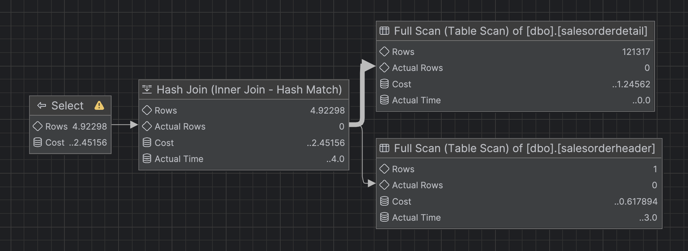

Analiza zapytania z datą, dla której istnieją rekordy:
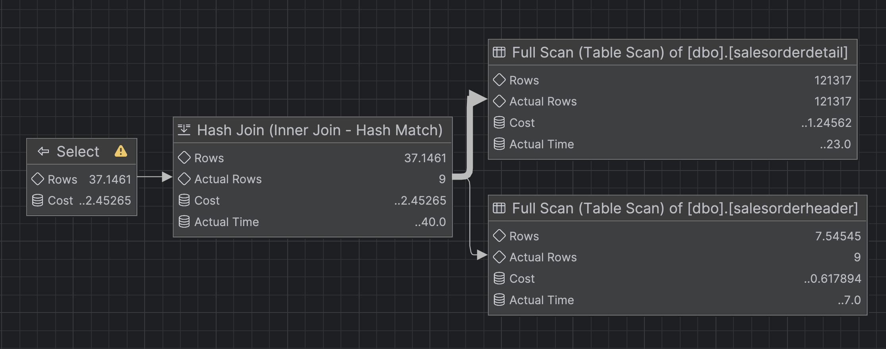

```
 2. Najpierw równolegle wykonywane są Table Scan na tabelach, następnie robiony jest hash match tworzy hash mapę z 
 salesorderid i dopasowuje rekordy z tabel do siebie czyli robi joina. Potem znowy przy pomocy hash match-a tworzona
 jest hash mapa gdzie kluczami są kolumny po których robimy groupby czyli orderdate, productid i potem dopasowywane
 są rokordy z zjoinowanej tabeli po kluczu i sumowane są tam wartości orderqty, unitpricediscount, i linetotal. 
 Sensowne jest dodanie indeksu na salesorderid żeby przyspieszyć joina, natomiast wydaje nam się że z kolei groupby nie
 będzie działał szybciej nawet jeśli dodamy indeksy na orderdate, productid, bo i tak musimy przejść przez całą
 zjoinowaną tabelę żeby te dane zgrupować.
```

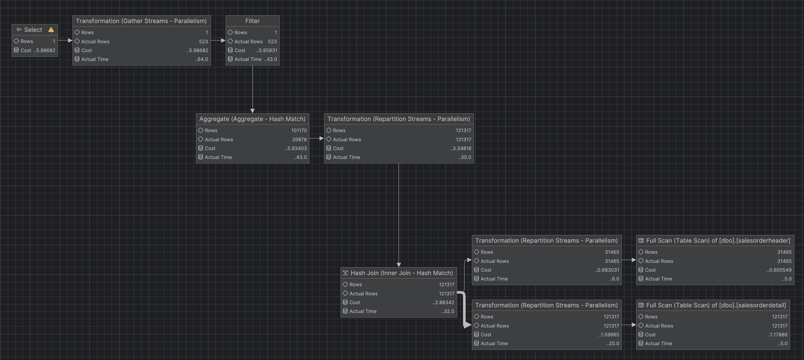

```
 3. Tak samo jak w przypadku 1 (po zmianie daty na istniejące w tabeli) wykonywane są 2 full scany na tabelach
 salesorderheader i salesorderdetail a następnie robiony jest hash match, który tworzy hash mapę pomiędzy
 gdzie kluczami są salesorderid z tabeli salesorderheader które spełniają where-a, a następnie jest robione
 przejście po tabeli salesorderdetail i sprawdzane jest czy jego salesorderid jest w hash mapie i jeśli tak
 to robiony jest join. Indeksy można dodać tak samo jak 1.
```


```
 4. Podobnie jak w 1 i 3 mamy 2 full scany gdzie jeden wyciąga wszystkie wiersze z salesorderheader, a drugi tylko
 te z salesorderdetail które spełniają where-a. Potem tabele są joinowane hash matchem tylko tym razem dopasowywane będą
 wiersze z salesorderheader, bo jest ich więcej (z salesorderdetail wyciągamy tylko 68 wiersze które spełniają where-a)
 Na końcu robione jest sortowanie po salesorderid. 
 Jeśli chodzi o optymalizację tego zapytania to w pierwszej kolejności sensowne jest dodanie indeksu na 
 carriertrackingnumber, który przyspieszy where-a, potem aby przyspierszyć joina potrzebny jest indeks na salesorderid
 w tabeli salesorderheader (mógłby być to nawet klastrowany indeks bo salesorderid wygląda jak dobry kandydat na klucz
 główny w tej tabeli). Sortowanie można zrobić na końcu na tych kilkudziesięciu wierszach zjoinowanej tabeli i wtedy
 akurat indeks raczej nic nie przyspieszy.
```

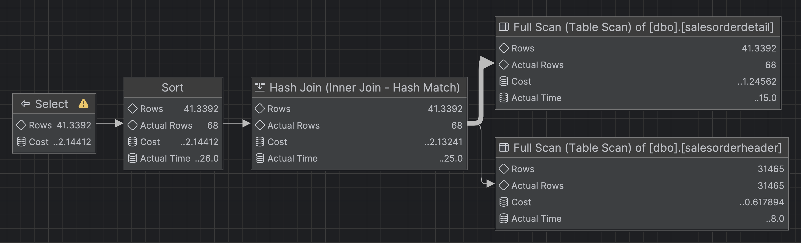

---


<div style="page-break-after: always;"></div>

# Zadanie 2 - Optymalizacja

Zaznacz wszystkie zapytania, i uruchom je w **Database Engine Tuning Advisor**:

<!-- ![[_img/index1-12.png | 500]] -->


Sprawdź zakładkę **Tuning Options**, co tam można skonfigurować?

---
> Wyniki: 

```
Można w pierwszej kolejności wybrać PDS (Physical Design Structures) które mogą zostać użyte do tuningu. 
Do wyboru są między innymi indexes, indexed views, indexes and indexed views, nonclustered indexes itd.
czyli w skrócie wybieramy tutaj formę w jakiej fizycznie będą zapisane nasze usprawnienia.
Możemy też wybrać czy chcemy wykonać partycjonowanie.
Na koniec możemy wybrać co się ma stać z istniejącymi PDS, czyli na przykład Keep all existing PDS lub 
Keep indexes only itd.
```

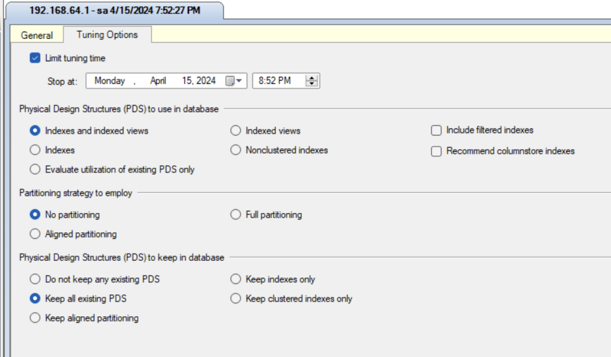

---


Użyj **Start Analysis**:

<!-- ![[_img/index1-3.png | 500]] -->


Zaobserwuj wyniki w **Recommendations**.

Przejdź do zakładki **Reports**. Sprawdź poszczególne raporty. Główną uwagę zwróć na koszty i ich poprawę:


<!-- ![[_img/index4-1.png | 500]] -->


Zapisz poszczególne rekomendacje:

Uruchom zapisany skrypt w Management Studio.

Opisz, dlaczego dane indeksy zostały zaproponowane do zapytań:

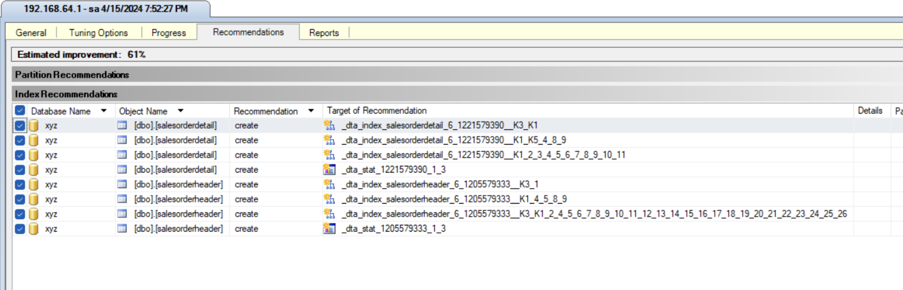

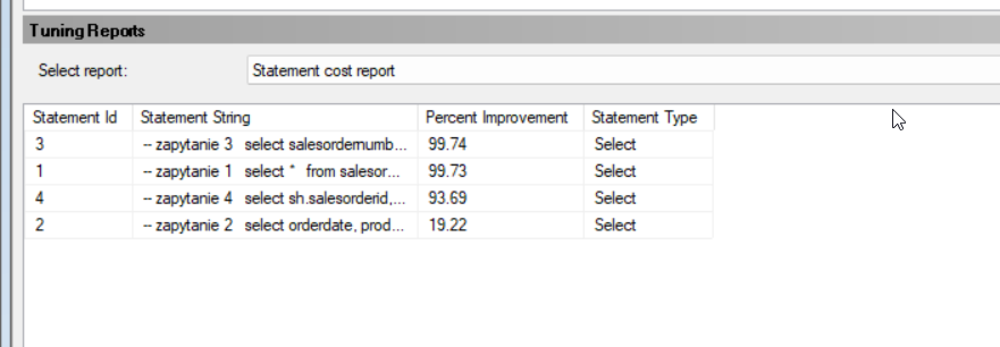

---
> Wyniki: 

```
Wybraliśmy opcję indexes, bo domyślna opcja indexes and indexed views tworzy widoki, które na przykład w przypadku
2 zapytania z groupby dosłownie stworzyło widok już z joinem i groupby, więc wtedy wystarczyłoby tylko wybrać
z niego wherem po warunku dane wiersze, ciekawsze wydają się same indeksy które mogą być bardziej uniwersalne do
różnych zapytań. 

Zostało zaproponowane 6 indeksów nonclustered:
Dla tabel salesorderheader:
 1. kolumny kluczowe: [OrderDate] ASC, [SalesOrderID] ASC ; kolumny dołączone: pozostałe kolumny tabeli
 2. kolumny kluczowe: [SalesOrderID] ASC ; kolumny dołączone: [DueDate], [ShipDate], [SalesOrderNumber], [PurchaseOrderNumber]
 3. kolumny kluczowe: [OrderDate] ASC ; kolumny dołączone: [SalesOrderID]
Dla tabeli salesorderdetails:
 4. kolumny kluczowe: [SalesOrderID] ASC ; kolumny dołączone: pozostałe kolumny tabeli
 5. kolumny kluczowe: [SalesOrderID] ASC, [ProductID] ASC ; kolumny dołączone: [OrderQty], [UnitPriceDiscount], [LineTotal]
 6. kolumny kluczowe: [CarrierTrackingNumber] ASC, [SalesOrderID] ASC

Indeksy 1, 4 optymalizują zapytania 1 i 3.
Indeksy 3, 5 optymalizują zapytanie 2.
Indeksy 2, 6 optymalizują zapytanie 4.
Dokładna analiza tego w jaki sposób je optymalizują znajduje się przy porównaniu Execution Planów poniżej.
```

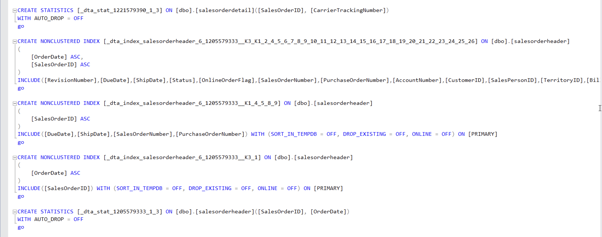

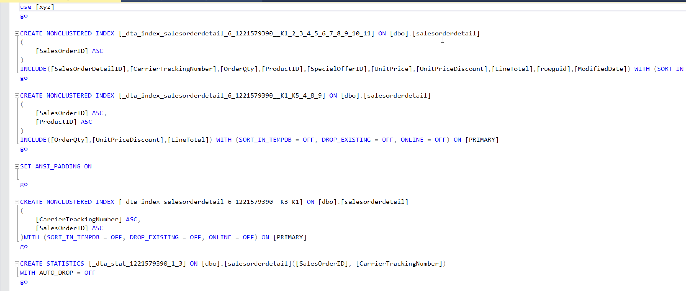

---


Sprawdź jak zmieniły się Execution Plany. Opisz zmiany:

---
> Wyniki: 

```
Indeksy numerujemy jak w powyższej liście indeksów
```

```
 1. Pierwsze zapytanie dzięki indeksom zamiast robić 2 full scany wykorzystuje indeks numer 1 do wyciągnięcia z salesorderheader
 rekordów spełniających warunek z datą, a następnie indeks numer 4 do wyciągnięcia z salesorderdetails rekordów z pasującym SalesOrderID.
 Wykorzystanie tych indeksów powoduje też że zmieniony został sposób wykonywania inner joina z hash match na nested loops, który
 z wykorzystaniem indeksów jest szybszy (prawdopodobnie z powodu niewielkiej liczby wierszy do której trzeba dopasować wiersz z drugiej tabeli).
```
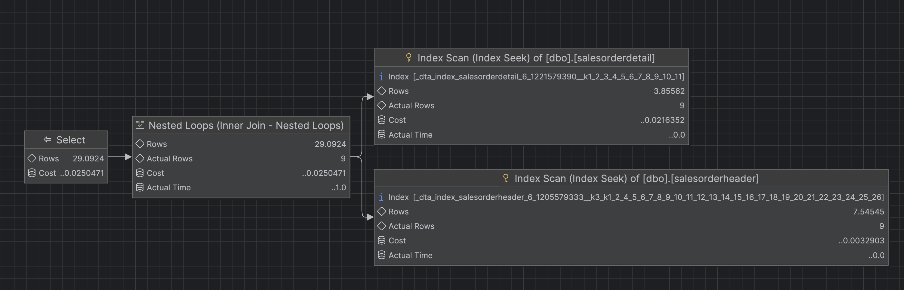

```
 2. Zamiast 2 full scanów wykonywane są 2 full index scany, pierwszy dla tabeli salesorderheader wykorzystuje indeks numer 3 a drugi 
 dla tabeli salesorderdetails używa indeksu numer 5. Indeks 3 wyciąga SalesOrderID posortowane po OrderDate, natomiast indeks 5 sortując po 
 SalesOrderID i ProductID wyciąga dane potrzebne do policzenia sum orderqty, unitpricediscount i linetotal, dzięki temu po joinie tak 
 pobrane dane są już posortowane po OrderDate i ProductID co pozwala na szybsze policzenie sum do groupby.
```
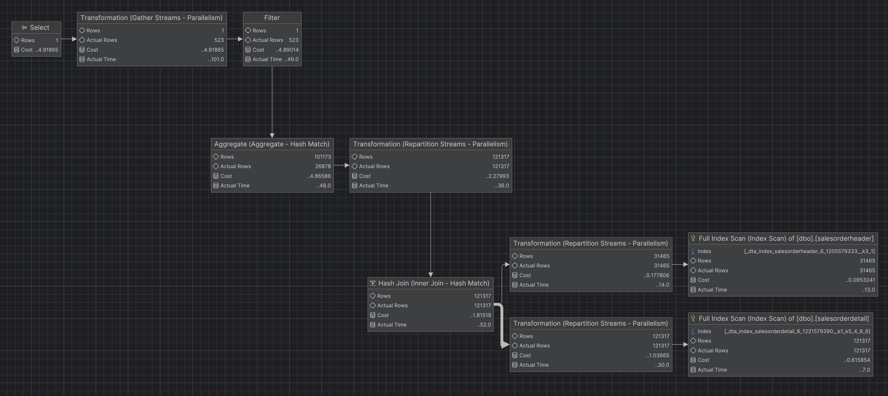

```
 3. Plan wykonania taki sam jak w 1. oraz wykorzystywane są te same indeksy.
```
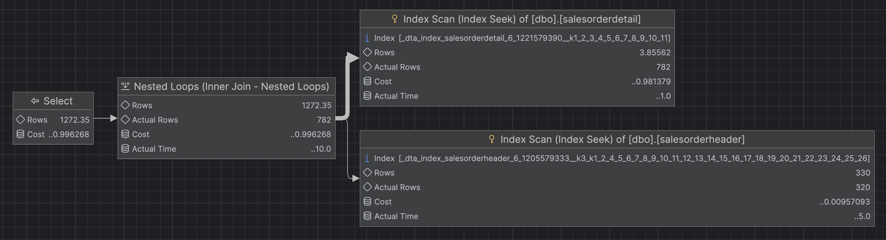

```
 4. Wykonywany jest index seek który wyciąga z tabeli salesorderdetails dane o odpowienim 
 carriertrackingnumber przy pomocy indeksu numer 6, dane są od razu sortowane po SalesOrderID jeszcze przed joinem.
 Dla wyciągniętych SalesOrderID robiony jest drugi index seek na tabeli salesorderheader używający indeksu numer 2,
 który wyciąga pozostałe potrzebne dane. Na koniec robiony jest join i dane po joinie są już posortowane.
```


---


<div style="page-break-after: always;"></div>

# Zadanie 3 - Kontrola "zdrowia" indeksu

## Dokumentacja/Literatura

Celem kolejnego zadania jest zapoznanie się z możliwością administracji i kontroli indeksów.

Na temat wewnętrznej struktury indeksów można przeczytać tutaj:
- [https://technet.microsoft.com/en-us/library/2007.03.sqlindex.aspx](https://technet.microsoft.com/en-us/library/2007.03.sqlindex.aspx)
- [https://docs.microsoft.com/en-us/sql/relational-databases/system-dynamic-management-views/sys-dm-db-index-physical-stats-transact-sql](https://docs.microsoft.com/en-us/sql/relational-databases/system-dynamic-management-views/sys-dm-db-index-physical-stats-transact-sql)
- [https://docs.microsoft.com/en-us/sql/relational-databases/system-dynamic-management-views/sys-dm-db-index-physical-stats-transact-sql](https://docs.microsoft.com/en-us/sql/relational-databases/system-dynamic-management-views/sys-dm-db-index-physical-stats-transact-sql)
- [https://docs.microsoft.com/en-us/sql/relational-databases/system-catalog-views/sys-indexes-transact-sql](https://docs.microsoft.com/en-us/sql/relational-databases/system-catalog-views/sys-indexes-transact-sql)

Sprawdź jakie informacje można wyczytać ze statystyk indeksu:

```sql
select *  
from sys.dm_db_index_physical_stats (db_id('adventureworks2017')  
,object_id('humanresources.employee')  
,null -- null to view all indexes; otherwise, input index number  
,null -- null to view all partitions of an index  
,'detailed') -- we want all information
```

Jakie są według Ciebie najważniejsze pola?

---
> Wyniki: 

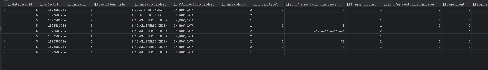

```
Naszym zdaniem najważniejsze pola to:
 - database_id, object_id, index_id (pola pozwalające na identyfikację rekordu)
 - index_type_desc (typ indeksu)
 - avg_fragmentation_in_percent (średni procent fragmentacji, może sugerować kiedy należy przebudować indeks)
 - avg_page_space_used_in_percent (ile procent każdej strony indeksu jest zajęte, dla odczytu lepszy duży procent, 
   dla zapisywania lepszy mały procent)
 - record_count (ilość rekordów w indeksie, określa jak duży jest indeks)
 - ghost_record_count (ilość zbędnych rekordów, które zostaną usunięte przez system)
```

---


Sprawdź, które indeksy w bazie danych wymagają reorganizacji:

```sql
use adventureworks2017  
  
select object_name([object_id]) as 'table name',  
index_id as 'index id'  
from sys.dm_db_index_physical_stats (db_id('adventureworks2017')  
,null -- null to view all tables  
,null -- null to view all indexes; otherwise, input index number  
,null -- null to view all partitions of an index  
,'detailed') --we want all information  
where ((avg_fragmentation_in_percent > 10  
and avg_fragmentation_in_percent < 15) -- logical fragmentation  
or (avg_page_space_used_in_percent < 75  
and avg_page_space_used_in_percent > 60)) --page density  
and page_count > 8 -- we do not want indexes less than 1 extent in size  
and index_id not in (0) --only clustered and nonclustered indexes
```


---
> Wyniki: 
> zrzut ekranu/komentarz:

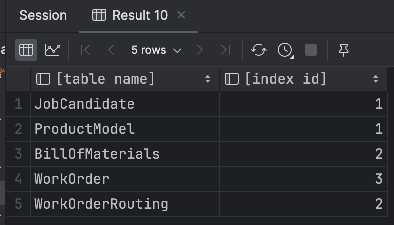

```
Zapytanie zwróciło indeksy jako nazwe tabeli i numer indeksu, aby odczytać nazwy indeksów wykonaliśmy dodatkowe zapytanie:
```

```sql
select sys.objects.name, sys.indexes.index_id, sys.indexes.name
from sys.indexes
inner join sys.objects on sys.indexes.object_id = sys.objects.object_id
where sys.objects.name in ('JobCandidate', 'ProductModel', 'BillOfMaterials', 'WorkOrder', 'WorkOrderRouting')
```

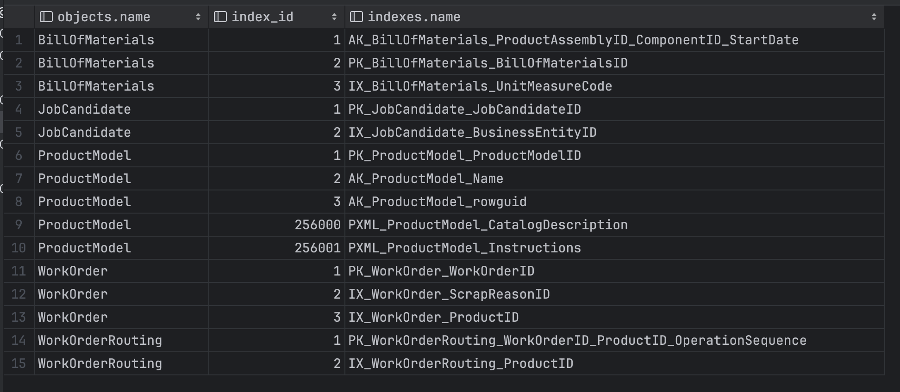

```
Ostatecznie odczytaliśmy nazwy indeksów wymagających reorganizacji:
- PK_JobCandidate_JobCandidateID
- PK_ProductModel_ProductModelID
- PK_BillOfMaterials_BillOfMaterialsID
- IX_WorkOrder_ProductID
- IX_WorkOrderRouting_ProductID
```

---


Sprawdź, które indeksy w bazie danych wymagają przebudowy:

```sql
use adventureworks2017  
  
select object_name([object_id]) as 'table name',  
index_id as 'index id'  
from sys.dm_db_index_physical_stats (db_id('adventureworks2017')  
,null -- null to view all tables  
,null -- null to view all indexes; otherwise, input index number  
,null -- null to view all partitions of an index  
,'detailed') --we want all information  
where ((avg_fragmentation_in_percent > 15) -- logical fragmentation  
or (avg_page_space_used_in_percent < 60)) --page density  
and page_count > 8 -- we do not want indexes less than 1 extent in size  
and index_id not in (0) --only clustered and nonclustered indexes
```

---
> Wyniki: 
> zrzut ekranu/komentarz:


```
W analogiczny sposób odczytaliśmy nazwy indeksów wymagających przebudowy:
- XMLPATH_Person_Demographics
- XMLPROPERTY_Person_Demographics
- XMLVALUE_Person_Demographics
```

---

Czym się różni przebudowa indeksu od reorganizacji?

(Podpowiedź: [http://blog.plik.pl/2014/12/defragmentacja-indeksow-ms-sql.html](http://blog.plik.pl/2014/12/defragmentacja-indeksow-ms-sql.html))

---
> Wyniki: 

```
Reorganizacja defragmentuje poszczególne strony indeksu, nie usuwa jednak fragmentacji pomiędzy stronami i nie zmienia 
ich struktury. Jest to proces nie zajmujący dużo dodatkowej pamięci.
Przebudowa tworzy nowy indeks, a następnie usuwa stary. W jej trakcie eliminowana jest cała fragmentacja nie tylko ze 
stron, ale również między stronami. Jest to jednak proces bardziej kosztowny i wymagający więcej dodatkowej pamięci niż
reorganizacja.
```

---

Sprawdź co przechowuje tabela sys.dm_db_index_usage_stats:

---
> Wyniki:


```
Przechowuje informacje na temat liczby użyć i daty ostatniego użycia operacji seek, scan, lookup i update
na poszczególnych indeksach przez użytkownika i system.
```

---


Napraw wykryte błędy z indeksami ze wcześniejszych zapytań. Możesz użyć do tego przykładowego skryptu:

```sql
use adventureworks2017  
  
--table to hold results  
declare @tablevar table(lngid int identity(1,1), objectid int,  
index_id int)  
  
insert into @tablevar (objectid, index_id)  
select [object_id],index_id  
from sys.dm_db_index_physical_stats (db_id('adventureworks2017')  
,null -- null to view all tables  
,null -- null to view all indexes; otherwise, input index number  
,null -- null to view all partitions of an index  
,'detailed') --we want all information  
where ((avg_fragmentation_in_percent > 15) -- logical fragmentation  
or (avg_page_space_used_in_percent < 60)) --page density  
and page_count > 8 -- we do not want indexes less than 1 extent in size  
and index_id not in (0) --only clustered and nonclustered indexes  
  
select 'alter index ' + ind.[name] + ' on ' + sc.[name] + '.'  
+ object_name(objectid) + ' rebuild'  
from @tablevar tv  
inner join sys.indexes ind  
on tv.objectid = ind.[object_id]  
and tv.index_id = ind.index_id  
inner join sys.objects ob  
on tv.objectid = ob.[object_id]  
inner join sys.schemas sc  
on sc.schema_id = ob.schema_id
```


Napisz przygotowane komendy SQL do naprawy indeksów:

---
> Wyniki: 

```sql
alter index XMLPATH_Person_Demographics on Person.Person rebuild
alter index XMLPROPERTY_Person_Demographics on Person.Person rebuild
alter index XMLVALUE_Person_Demographics on Person.Person rebuild
alter index PK_JobCandidate_JobCandidateID on HumanResources.JobCandidate reorganize
alter index PK_ProductModel_ProductModelID on Production.ProductModel reorganize
alter index PK_BillOfMaterials_BillOfMaterialsID on Production.BillOfMaterials reorganize
alter index IX_WorkOrder_ProductID on Production.WorkOrder reorganize
alter index IX_WorkOrderRouting_ProductID on Production.WorkOrderRouting reorganize
```

---

<div style="page-break-after: always;"></div>

# Zadanie 4 - Budowa strony indeksu

## Dokumentacja

Celem kolejnego zadania jest zapoznanie się z fizyczną budową strony indeksu 
- [https://www.mssqltips.com/sqlservertip/1578/using-dbcc-page-to-examine-sql-server-table-and-index-data/](https://www.mssqltips.com/sqlservertip/1578/using-dbcc-page-to-examine-sql-server-table-and-index-data/)
- [https://www.mssqltips.com/sqlservertip/2082/understanding-and-examining-the-uniquifier-in-sql-server/](https://www.mssqltips.com/sqlservertip/2082/understanding-and-examining-the-uniquifier-in-sql-server/)
- [http://www.sqlskills.com/blogs/paul/inside-the-storage-engine-using-dbcc-page-and-dbcc-ind-to-find-out-if-page-splits-ever-roll-back/](http://www.sqlskills.com/blogs/paul/inside-the-storage-engine-using-dbcc-page-and-dbcc-ind-to-find-out-if-page-splits-ever-roll-back/)

Wypisz wszystkie strony które są zaalokowane dla indeksu w tabeli. Użyj do tego komendy np.:

```sql
dbcc ind ('adventureworks2017', 'person.address', 1)  
-- '1' oznacza nr indeksu
```

Zapisz sobie kilka różnych typów stron, dla różnych indeksów:

---
> Wyniki: 

```
- 11712 person.address, 1, PageType 1
- 17856 production.workorder, 3, PageType 2
- 1168 person.person, 1, PageType 3
- 1135 person.emailaddress, 1, PageType 10
```

---

Włącz flagę 3604 zanim zaczniesz przeglądać strony:

```sql
dbcc traceon (3604);
```

Sprawdź poszczególne strony komendą DBCC PAGE. np.:

```sql
dbcc page('adventureworks2017', 1, 13720, 3);
```


Zapisz obserwacje ze stron. Co ciekawego udało się zaobserwować?

---
> Wyniki: 

```
Strona zawiera następujące sekcje: numer strony, buffer, header, allocation status i dane.
Dane podzielone są na sloty i kolumny, przy czym każda kolumna ma podaną długość. Istnieją również puste sloty, które
nie mają kolumn.
Nieco inna jest ostatnia ze sprawdzanych stron o typie 10, czyli IAM (Index Allocation Map). Opisuje ona jakie strony
są zaalokowane w jednostce alokacji przypisanej do danej strony IAM.
```

---

Punktacja:

|   |   |
|---|---|
|zadanie|pkt|
|1|3|
|2|3|
|3|3|
|4|1|
|razem|10|