# Indeksy,  optymalizator <br>Lab 5

<!-- <style scoped>
 p,li {
    font-size: 12pt;
  }
</style>  -->

<!-- <style scoped>
 pre {
    font-size: 8pt;
  }
</style>  -->


---

**Imię i nazwisko:** Dariusz Piwowarski, Wojciech Przybytek

--- 

Celem ćwiczenia jest zapoznanie się z planami wykonania zapytań (execution plans), oraz z budową i możliwością wykorzystaniem indeksów (cz. 2.)

Swoje odpowiedzi wpisuj w miejsca oznaczone jako:

---
> Wyniki: 

```sql
--  ...
```

---

Ważne/wymagane są komentarze.

Zamieść kod rozwiązania oraz zrzuty ekranu pokazujące wyniki, (dołącz kod rozwiązania w formie tekstowej/źródłowej)

Zwróć uwagę na formatowanie kodu

## Oprogramowanie - co jest potrzebne?

Do wykonania ćwiczenia potrzebne jest następujące oprogramowanie
- MS SQL Server,
- SSMS - SQL Server Management Studio    
- przykładowa baza danych AdventureWorks2017.
    
Oprogramowanie dostępne jest na przygotowanej maszynie wirtualnej


## Przygotowanie  

Uruchom Microsoft SQL Managment Studio.
    
Stwórz swoją bazę danych o nazwie XYZ. 

```sql
create database lab5  
go  
  
use lab5  
go
```


## Dokumentacja/Literatura

Obowiązkowo:

- [https://docs.microsoft.com/en-us/sql/relational-databases/indexes/indexes](https://docs.microsoft.com/en-us/sql/relational-databases/indexes/indexes)
- [https://docs.microsoft.com/en-us/sql/relational-databases/sql-server-index-design-guide](https://docs.microsoft.com/en-us/sql/relational-databases/sql-server-index-design-guide)
- [https://www.simple-talk.com/sql/performance/14-sql-server-indexing-questions-you-were-too-shy-to-ask/](https://www.simple-talk.com/sql/performance/14-sql-server-indexing-questions-you-were-too-shy-to-ask/)

Materiały rozszerzające:
- [https://www.sqlshack.com/sql-server-query-execution-plans-examples-select-statement/](https://www.sqlshack.com/sql-server-query-execution-plans-examples-select-statement/)

<div style="page-break-after: always;"></div>

# Zadanie 1 - Indeksy klastrowane I nieklastrowane

Skopiuj tabelę `Customer` do swojej bazy danych:

```sql
select * into customer from adventureworks2017.sales.customer
```

Wykonaj analizy zapytań:

```sql
select * from customer where storeid = 594  
  
select * from customer where storeid between 594 and 610
```

Zanotuj czas zapytania oraz jego koszt koszt:

---
> Wyniki: 

Pierwsze zapytanie
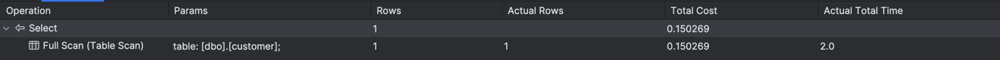
Drugie zapytanie


```
Czas zapytania - 2.0ms
Koszt zapytania - 0.150269

Czas zapytania - 2.0ms
Koszt zapytania - 0.150269
```


Dodaj indeks:

```sql
create  index customer_store_cls_idx on customer(storeid)
```

Jak zmienił się plan i czas? Czy jest możliwość optymalizacji?


---
> Wyniki: 

Pierwsze zapytanie
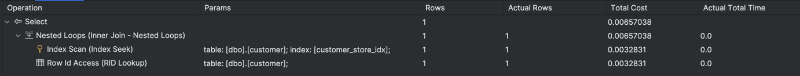
Drugie zapytanie
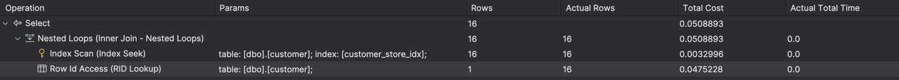

```
Czas zapytania - 0.0ms
Koszt zapytania - 0.00657038

Czas zapytania - 0.0ms
Koszt zapytania - 0.0508893

Czas i koszt poprawił się względem zapytania bez indeksu. Wykonywana jest jedna dodatkowa operacja dostępu do wiersza,
ponieważ rekordy nie są fizycznie posortowane względem storeid, a jedynie wskaźniki do nich. Gdyby rekordy były już
posortowane to przyspieszyłoby to wykonanie zapytania.
```


Dodaj indeks klastrowany:

```sql
create clustered index customer_store_cls_idx on customer(storeid)
```

Czy zmienił się plan i czas? Skomentuj dwa podejścia w wyszukiwaniu krotek.


---
> Wyniki: 

Pierwsze zapytanie
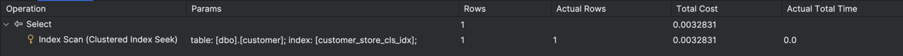
Drugie zapytanie
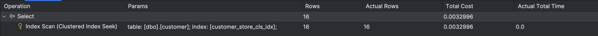

```
1.
Czas zapytania - 0.0ms
Koszt zapytania - 0.0032831

2.
Czas zapytania - 0.0ms
Koszt zapytania - 0.0032996

Czas nie zmienił się, a w planie zamiast Index Seek widoczny jest Clustered Index Seek. Dodatkowo nie są
wykonywane operacje dostępu do wiersza, ponieważ te są fizycznie uporządkowane według kolumny storeid. Wynika stąd,
że użycie indeksu klastrowego jest szybsze niż nieklastrowego, ponieważ nie jest potrzebna operacja dostępu do wiersza.
```


# Zadanie 2 – Indeksy zawierające dodatkowe atrybuty (dane z kolumn)

Celem zadania jest poznanie indeksów z przechowujących dodatkowe atrybuty (dane z kolumn)

Skopiuj tabelę `Person` do swojej bazy danych:

```sql
select businessentityid  
      ,persontype  
      ,namestyle  
      ,title  
      ,firstname  
      ,middlename  
      ,lastname  
      ,suffix  
      ,emailpromotion  
      ,rowguid  
      ,modifieddate  
into person  
from adventureworks2017.person.person
```
---

Wykonaj analizę planu dla trzech zapytań:

```sql
select * from [person] where lastname = 'Agbonile'  
  
select * from [person] where lastname = 'Agbonile' and firstname = 'Osarumwense'  
  
select * from [person] where firstname = 'Osarumwense'
```

Co można o nich powiedzieć?


---
> Wyniki: 

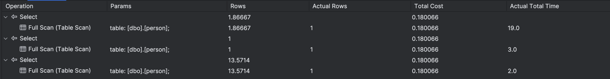

```
Dla każdego zapytania wykonywany jest Table Scan, co oznacza, że podczas zapytania naiwnie przeszukiwane są wszystkie
rekordy w tabeli, które spełniają warunek. Każde z zapytań możnaby zoptymalizować indeksem.
```

Przygotuj indeks obejmujący te zapytania:

```sql
create index person_first_last_name_idx  
on person(lastname, firstname)
```

Sprawdź plan zapytania. Co się zmieniło?


---
> Wyniki: 

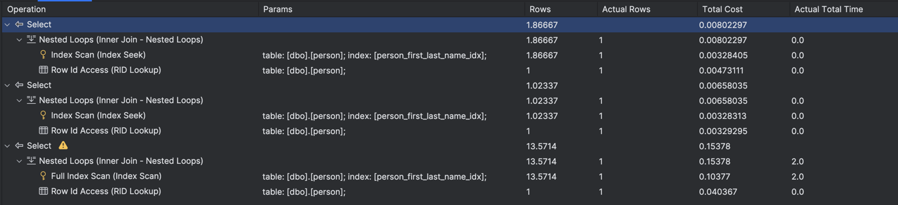

```
Dla 2 pierwszych zapytań czas i koszt zmalał, a Table Scan został zastąpiony przez Index Seek i Row Id Lookup. 
Inaczej sytuacja ma się w 3 zapytaniu, gdzie czas i koszt nie zmienił się znacząco, a zamiast Index Seek wykonywana jest
operacja Index Scan. Pierwszym polem w indeksie jest kolumna lastname, a więc indeks ten nie pomaga w wykonaniu 
zapytania.
```


Przeprowadź ponownie analizę zapytań tym razem dla parametrów: `FirstName = ‘Angela’` `LastName = ‘Price’`. (Trzy zapytania, różna kombinacja parametrów). 

Czym różni się ten plan od zapytania o `'Osarumwense Agbonile'` . Dlaczego tak jest?


---
> Wyniki: 

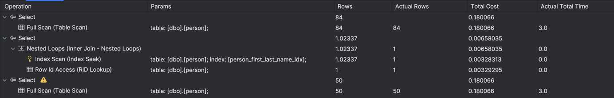

```
Tym razem tylko dla 2 zapytania wykorzystywany jest indeks, 1 i 3 zapytanie wykonują Table Scan, tak jak w przypadku,
gdy indeksu nie było. Wynika to z faktu, że jest bardzo mało rekordów dla pierwszych danych, a dla drugich znacznie
więcej. Z tego powodu planer silnika baz danych estymuje, że dla takiej ilości wierszy i tak będzie musiał przejśc przez
sporą część indeksu i dla każdego wykonać Row Id Lookup, a więc bardziej opłacalne będzie przejście przez wszystkie 
wiersze tak jak fizycznie są posortowane w tabeli.
```


# Zadanie 3

Skopiuj tabelę `PurchaseOrderDetail` do swojej bazy danych:

```sql
select * into purchaseorderdetail from  adventureworks2017.purchasing.purchaseorderdetail
```

Wykonaj analizę zapytania:

```sql
select rejectedqty, ((rejectedqty/orderqty)*100) as rejectionrate, productid, duedate  
from purchaseorderdetail  
order by rejectedqty desc, productid asc
```

Która część zapytania ma największy koszt?

---
> Wyniki: 

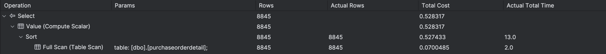

```
Sort:
Czas zapytania - 13.0ms
Koszt zapytania - 0.527433

Full scan:
Czas zapytania - 2.0ms
Koszt zapytania - 0.0700485

Największy koszt ma operacja Sort
```

Jaki indeks można zastosować aby zoptymalizować koszt zapytania? Przygotuj polecenie tworzące index.


---
> Wyniki: 

```sql
create index purchaseorderdetail_rejectedqty_desc_productid_asc_idx
on purchaseorderdetail (rejectedqty desc, productid asc)
include (orderqty, duedate);
```

 Ponownie wykonaj analizę zapytania:

---
> Wyniki: 

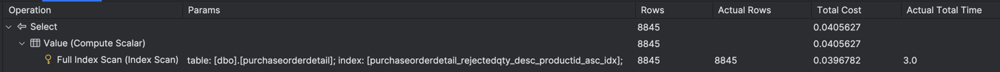

```
Operacje Sort i Full Scan zostały zastąpione przez jedną operację Full index scan.
Jej koszt i czas to:
Czas zapytania - 3.0ms
Koszt zapytania - 0.0405627

Udało nam się zredukować koszt operacji Sort, dodając indeks, przez co nie jest ona już konieczna, a wykonywany jest
jedynie full index scan.
```

# Zadanie 4

Celem zadania jest porównanie indeksów zawierających wszystkie kolumny oraz indeksów przechowujących dodatkowe dane (dane z kolumn).

Skopiuj tabelę `Address` do swojej bazy danych:

```sql
select * into address from  adventureworks2017.person.address
```

W tej części będziemy analizować następujące zapytanie:

```sql
select addressline1, addressline2, city, stateprovinceid, postalcode  
from address  
where postalcode between n'98000' and n'99999'
```

```sql
create index address_postalcode_1  
on address (postalcode)  
include (addressline1, addressline2, city, stateprovinceid);  
go  
  
create index address_postalcode_2  
on address (postalcode, addressline1, addressline2, city, stateprovinceid);  
go
```


Czy jest widoczna różnica w zapytaniach? Jeśli tak to jaka? Aby wymusić użycie indeksu użyj `WITH(INDEX(Address_PostalCode_1))` po `FROM`:

> Wyniki:

```sql
select addressline1, addressline2, city, stateprovinceid, postalcode
from address with(index(address_postalcode_1))
where postalcode between '98000' and '99999'

select addressline1, addressline2, city, stateprovinceid, postalcode
from address with(index(address_postalcode_2))
where postalcode between '98000' and '99999'
```

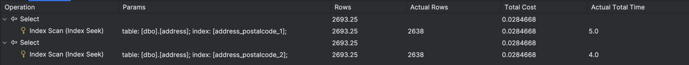

```
Oba zapytania mają ten sam plan, koszt i czas wykonania, zamiast Table Scan wykonywany jest Index Seek.
```


Sprawdź rozmiar Indeksów:

```sql
select i.name as indexname, sum(s.used_page_count) * 8 as indexsizekb  
from sys.dm_db_partition_stats as s  
inner join sys.indexes as i on s.object_id = i.object_id and s.index_id = i.index_id  
where i.name = 'address_postalcode_1' or i.name = 'address_postalcode_2'  
group by i.name  
go
```


Który jest większy? Jak można skomentować te dwa podejścia do indeksowania? Które kolumny na to wpływają?


> Wyniki: 

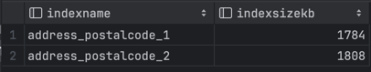

```
Indeks address_postalcode_2 jest większy. W tym indeksie wszystkie kolumny użyte do jego stworzenia są częścią b-drzewa,
co nie dzieje się w przypadku indeksu pierwszego, w którym do budowy b-drzewa wykorzystywana jest tylko kolumna
postalcode. Indeks pierwszy będzie lepszy w przypadku kiedy tylko kolumna postalcode będzie wykorzystywana do warunku
WHERE, a reszta kolumn jest tylko pobierana, ponieważ zajmuje mniej miejsca. Drugi indeks będzie lepszy kiedy do
warunków WHERE wykorzystamy wiele kolumn, ponieważ przyspieszy to czas wykonania zapytania co rekompensuje różnicę w
zajmowanej pamięci.
```


# Zadanie 5 – Indeksy z filtrami

Celem zadania jest poznanie indeksów z filtrami.

Skopiuj tabelę `BillOfMaterials` do swojej bazy danych:

```sql
select * into billofmaterials  
from adventureworks2017.production.billofmaterials
```


W tej części analizujemy zapytanie:

```sql
select productassemblyid, componentid, startdate  
from billofmaterials  
where enddate is not null  
    and componentid = 327  
    and startdate >= '2010-08-05'
```

Zastosuj indeks:

```sql
create nonclustered index billofmaterials_cond_idx  
    on billofmaterials (componentid, startdate)  
    where enddate is not null
```

Sprawdź czy działa. 

Przeanalizuj plan dla poniższego zapytania:

Czy indeks został użyty? Dlaczego?

> Wyniki: 

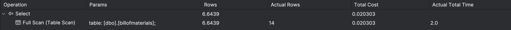

```
Dalej jest wykonywany Full scan a nie Full index scan oraz nie zmienił się koszt, co sugeruje że indeks nie jest używany
```

Spróbuj wymusić indeks. Co się stało, dlaczego takie zachowanie?

> Wyniki: 

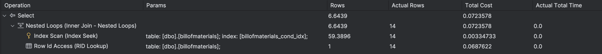

```
Przez to że w indeksie brakuje include(productassemblyid), to pomimo użycia indeksu konieczne jest wykonanie
operacji Row Id Access która jest na tyle kosztowna, że nie opłaca się używać tego indeksu
```


---

Punktacja:

|         |     |
| ------- | --- |
| zadanie | pkt |
| 1       | 2   |
| 2       | 2   |
| 3       | 2   |
| 4       | 2   |
| 5       | 2   |
| razem   | 10  |
