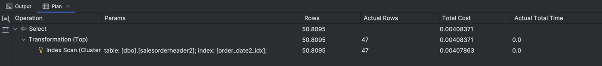

# Indeksy,  optymalizator <br>Lab 6-7

<!-- <style scoped>
 p,li {
    font-size: 12pt;
  }
</style>  -->

<!-- <style scoped>
 pre {
    font-size: 8pt;
  }
</style>  -->


---

**Imię i nazwisko: Dariusz Piwowarski, Wojciech Przybytek**

--- 

Celem ćwiczenia jest zapoznanie się z planami wykonania zapytań (execution plans), oraz z budową i możliwością wykorzystaniem indeksów (cz. 2.)

Swoje odpowiedzi wpisuj w miejsca oznaczone jako:

---
> Wyniki: 

```sql
--  ...
```

---

Ważne/wymagane są komentarze.

Zamieść kod rozwiązania oraz zrzuty ekranu pokazujące wyniki, (dołącz kod rozwiązania w formie tekstowej/źródłowej)

Zwróć uwagę na formatowanie kodu

## Oprogramowanie - co jest potrzebne?

Do wykonania ćwiczenia potrzebne jest następujące oprogramowanie
- MS SQL Server,
- SSMS - SQL Server Management Studio    
- przykładowa baza danych AdventureWorks2017.
    
Oprogramowanie dostępne jest na przygotowanej maszynie wirtualnej

## Przygotowanie  


    
Stwórz swoją bazę danych o nazwie lab6. 

```sql
create database lab5  
go  
  
use lab5  
go
```

## Dokumentacja

Obowiązkowo:
- [https://docs.microsoft.com/en-us/sql/relational-databases/indexes/indexes](https://docs.microsoft.com/en-us/sql/relational-databases/indexes/indexes)
- [https://docs.microsoft.com/en-us/sql/relational-databases/indexes/create-filtered-indexes](https://docs.microsoft.com/en-us/sql/relational-databases/indexes/create-filtered-indexes)

# Zadanie 1

Skopiuj tabelę Product do swojej bazy danych:

```sql
select * into product from adventureworks2017.production.product
```

Stwórz indeks z warunkiem przedziałowym:

```sql
create nonclustered index product_range_idx  
    on product (productsubcategoryid, listprice) include (name)  
where productsubcategoryid >= 27 and productsubcategoryid <= 36
```

Sprawdź, czy indeks jest użyty w zapytaniu:

```sql
select name, productsubcategoryid, listprice  
from product  
where productsubcategoryid >= 27 and productsubcategoryid <= 36
```

Sprawdź, czy indeks jest użyty w zapytaniu, który jest dopełnieniem zbioru:

```sql
select name, productsubcategoryid, listprice  
from product  
where productsubcategoryid < 27 or productsubcategoryid > 36
```


Skomentuj oba zapytania. Czy indeks został użyty w którymś zapytaniu, dlaczego? Czy indeks nie został użyty w którymś zapytaniu, dlaczego? Jak działają indeksy z warunkiem?


---
> Wyniki: 

Pierwsze zapytanie

Drugie zapytanie


```
Indeks został użyty w pierwszym zapytaniu (Index Scan), ponieważ klauzula where w zapytaniu mieści się w przedziale
klauzuli where w indeksie. Indeks nie został za to użyty w drugim zapytaniu (Table Scan), ponieważ przedziały w 
klauzulach where zapytania i indeksu są rozłączne, a więc indeks nie zawiera rekordów, które są wyciągane z tabeli przy
tym zapytaniu. Indeksy z warunkiem zawierają tylko te rekordy, które spełniają owy warunek.
```


# Zadanie 2 – indeksy klastrujące

Celem zadania jest poznanie indeksów klastrujących

Skopiuj ponownie tabelę SalesOrderHeader do swojej bazy danych:

```sql
select * into salesorderheader2 from adventureworks2017.sales.salesorderheader
```


Wypisz sto pierwszych zamówień:

```sql
select top 1000 * from salesorderheader2  
order by orderdate
```

Stwórz indeks klastrujący według OrderDate:

```sql
create clustered index order_date2_idx on salesorderheader2(orderdate)
```

Wypisz ponownie sto pierwszych zamówień. Co się zmieniło?

---
> Wyniki: 

Przed stworzeniem indeksu

Po stworzeniu indeksu


```
Bez indeksu wykonywane są operacje Table Scan oraz TopN Sort, a więc po pobraniu rekordów są one dodatkowo sortowane. 
Po stworzeniu indeksu wykonywane są operacje Culstered Index Scan oraz Top, a więc po pobraniu rekordów nie są one
dodatkowo sortowane, ponieważ są już w poprawnej kolejności dzięki zastosowaniu indeksu klastującego.
```


Sprawdź zapytanie:

```sql
select top 1000 * from salesorderheader2  
where orderdate between '2010-10-01' and '2011-06-01'
```


Dodaj sortowanie według OrderDate ASC i DESC. Czy indeks działa w obu przypadkach. Czy wykonywane jest dodatkowo sortowanie?


---
> Wyniki: 

ASC

DESC


```
Indeks działa zarówno dla sortowania ASC (kolejność w jakiej rekordy są fizycznie posortowane) jak i DESC (kolejność
odwrotna) i w żadnym z przypadków nie ma dodatkowego sortowania. Wynika stąd, że nie ma potrzeby tworzenia dodatkowego
indeksu z odwrotną kolejnością sortowania, jeżeli planujemy wykonywać zapytania z sortowaniem.  
```


# Zadanie 3 – indeksy column store


Celem zadania jest poznanie indeksów typu column store

Utwórz tabelę testową:

```sql
create table dbo.saleshistory(  
 salesorderid int not null,  
 salesorderdetailid int not null,  
 carriertrackingnumber nvarchar(25) null,  
 orderqty smallint not null,  
 productid int not null,  
 specialofferid int not null,  
 unitprice money not null,  
 unitpricediscount money not null,  
 linetotal numeric(38, 6) not null,  
 rowguid uniqueidentifier not null,  
 modifieddate datetime not null  
 )
```

Załóż indeks:

```sql
create clustered index saleshistory_idx  
on saleshistory(salesorderdetailid)
```


Wypełnij tablicę danymi:

(UWAGA    `GO 100` oznacza 100 krotne wykonanie polecenia. Jeżeli podejrzewasz, że Twój serwer może to zbyt przeciążyć, zacznij od GO 10, GO 20, GO 50 (w sumie już będzie 80))

```sql
insert into saleshistory  
 select sh.*  
 from adventureworks2017.sales.salesorderdetail sh  
go 100
```

Sprawdź jak zachowa się zapytanie, które używa obecny indeks:

```sql
select productid, sum(unitprice), avg(unitprice), sum(orderqty), avg(orderqty)  
from saleshistory  
group by productid  
order by productid
```

Załóż indeks typu ColumnStore:

```sql
create nonclustered columnstore index saleshistory_columnstore  
 on saleshistory(unitprice, orderqty, productid)
```

Sprawdź różnicę pomiędzy przetwarzaniem w zależności od indeksów. Porównaj plany i opisz różnicę.


---
> Wyniki:

Indeks klastrowany

Indeks typu ColumnStore


```
Dla obu indeksów plany wykonania są bardzo podobne, najpierw wykonywany jest Index Scan (na odpowiednim indeksie)
następnie Hash Match aby pogrupować rekordy, Compute Scalar aby wyliczyć sumy i średnie, a na końcu rekordy są sortowane
według productid. Istotną różnicą między wykonaniami są natomiast czasy trwania zapytań oraz ich koszt, zapytanie z
indeksem typu ColumnStore wykonuje się dużo szybciej i efektowniej niż przy użyciu indeksu klastrowanego.
Indeksy ColumnStore przechowują fizycznie dane w kolumnach a nie w wierszach, co pozwala na dużo większą kompresję
i szybszy do nich dostęp ponieważ wzystkie dane są tego samego typu oraz mają podobne wartości.
```

# Zadanie 4 – własne eksperymenty

Należy zaprojektować tabelę w bazie danych, lub wybrać dowolny schemat danych (poza używanymi na zajęciach), a następnie wypełnić ją danymi w taki sposób, aby zrealizować poszczególne punkty w analizie indeksów. Warto wygenerować sobie tabele o większym rozmiarze.

Do analizy, proszę uwzględnić następujące rodzaje indeksów:
- Klastrowane (np.  dla atrybutu nie będącego kluczem głównym)
- Nieklastrowane
- Indeksy wykorzystujące kilka atrybutów, indeksy include
- Filtered Index (Indeks warunkowy)
- Kolumnowe

## Analiza

Proszę przygotować zestaw zapytań do danych, które:
- wykorzystują poszczególne indeksy
- które przy wymuszeniu indeksu działają gorzej, niż bez niego (lub pomimo założonego indeksu, tabela jest w pełni skanowana)
Odpowiedź powinna zawierać:
- Schemat tabeli
- Opis danych (ich rozmiar, zawartość, statystyki)
- Trzy indeksy:
- Opis indeksu
- Przygotowane zapytania, wraz z wynikami z planów (zrzuty ekranow)
- Komentarze do zapytań, ich wyników
- Sprawdzenie, co proponuje Database Engine Tuning Advisor (porównanie czy udało się Państwu znaleźć odpowiednie indeksy do zapytania)


> Wyniki: 

Wygenerowano tabelę `dbo.PurchaseOrderHistory`

```sql
use lab5;

create table dbo.PurchaseOrderHistory(
    PurchaseOrderID int not null,
    RevisionNumber tinyint,
    Status tinyint,
    EmployeeID int,
    VendorID int,
    ShipMethodID int,
    OrderDate datetime,
    ShipDate datetime,
    SubTotal money,
    TaxAmt money,
    Freight money,
    TotalDue money,
    ModifiedDate datetime
);

insert into dbo.PurchaseOrderHistory
 select sh.*
 from adventureworks2017.Purchasing.PurchaseOrderHeader sh
go 60;

select count(*) as count from PurchaseOrderHistory;
```


Oraz tabelę `dbo.PurchaseOrderDetail`

```sql
create table dbo.PurchaseOrderDetail
(
    PurchaseOrderID       int           not null,
    PurchaseOrderDetailID int           not null,
    DueDate               datetime      not null,
    OrderQty              smallint      not null,
    ProductID             int           not null,
    UnitPrice             money         not null,
    LineTotal             money         not null,
    ReceivedQty           decimal(8, 2) not null,
    RejectedQty           decimal(8, 2) not null,
    StockedQty            decimal(9, 2) not null,
    ModifiedDate          datetime      not null
);

insert into dbo.PurchaseOrderDetail
select pod.*
from adventureworks2017.Purchasing.PurchaseOrderDetail pod;
```

### Eksperyment 1

Stworzono nieklastrowany indeks z klauzulą include `date_employee_index` zawierający informacje o dacie zamówienia i
wykonującego je pracownika.

```sql
create nonclustered index date_employee_index on PurchaseOrderHistory(OrderDate) include (EmployeeID);
```

Pozwala on efektywnie sprawdzać ile zamówień wykonali poszczególni pracownicy w danym dniu/przedziale czasowym, ponieważ
wykonany na tabeli zostanie Index Seek lub Index Scan w zależności od tego jaki procent wszystkich rekordów objemuje
wybrany przedział czasowy.

```sql
select EmployeeID, count(*) as OrdersCount from PurchaseOrderHistory where OrderDate = '2014-06-16' group by EmployeeID;
```


Jeżeli jednak postanowimy dodać nową kolumnę do zapytania, np. średnią wartość zamówienia w danym przedziale czasowym to
zauważymy, że stworzony wcześniej indeks nie jest używany.

```sql
select EmployeeID, count(*) as OrdersCount, avg(TotalDue) as AverageCost
from PurchaseOrderHistory
where OrderDate = '2014-06-16'
group by EmployeeID;
```


Wymuszając użycie indeksu możemy zauważyć, że najbardziej kosztowną operacją jest RID Lookup, czyli dostęp do wartości
kolumny TotalDue, przez co łączny koszt przewyższa ten kiedy przeszukiwana jest cała tabela.


Można ten problem rozwiązać zamieniając indeks na taki, który będzie zawierał również kolumnę TotalDue.

```sql
drop index date_employee_index on PurchaseOrderHistory;
create nonclustered index date_employee_total_index on PurchaseOrderHistory (OrderDate) include (EmployeeID, TotalDue);
```


Jeżeli jednak wykonamy teraz pierwotne zapytanie to zauważymy, że koszt wykonania zapytania zwiększył się używając
rozszerzonego indeksu.


Wynika stąd, że podczas tworzenia indeksów z klauzulą include należy uważać na to, których kolumn używamy, zbyt mała
ilość sprawi, że zapytania nieuwzględnione w indeksie będą bardziej kosztowne, nastomiast zbyt duża ilość spowolni
wszystkie pozostałe zapytania.

### Eksperyment 2

Przenalizujmy podobny przykład co w zadaniu 3, stworzono 2 indeksy na kolumnach OrderDate, PurchaseOrderID, TotalDue -
jeden klastrowany a drugi typu columnstore.

```sql
create columnstore index columnstore_index on PurchaseOrderHistory(OrderDate, PurchaseOrderID, TotalDue);
create clustered index clustered_index on PurchaseOrderHistory(OrderDate, PurchaseOrderID, TotalDue);
```

Następnie za pomocą tych indeksów pobrano ID i wartość 3 najdroższych zamówień w roku 2014.

```sql
select top 3 PurchaseOrderID, TotalDue
from PurchaseOrderHistory with (index (clustered_index))
where year(OrderDate) = 2014
order by TotalDue;

select top 3 PurchaseOrderID, TotalDue
from PurchaseOrderHistory with (index (columnstore_index))
where year(OrderDate) = 2014
order by TotalDue;
```


Jak widać użycie indeksu typu columnstore powoduje prawie 4-krotnie mniejszy koszt wykonania zapytania. Można więc
zastanowić się, czy indeksy columnstore nie są lepsze w każdym przypadku lepsze niż klasyczne indeksy. Jeżeli jednak
dodamy do zapytania jedną dodatkową kolumnę, np. ID sprzedawcy, to wyniki będą już nieco inne.

```sql
select top 3 PurchaseOrderID, TotalDue, VendorID
from PurchaseOrderHistory with (index (clustered_index))
where year(OrderDate) = 2014
order by TotalDue;

select top 3 PurchaseOrderID, TotalDue, VendorID
from PurchaseOrderHistory with (index (columnstore_index))
where year(OrderDate) = 2014
order by TotalDue;
```


Dla indeksu klastrowanego koszt wykonania zapytania pozostał taki sam, natomiast dla indeksu typu columnstore wzrósł
ponad 20-krotnie! Oznacza to, że klastrowane indeksy są dużo bardziej uniwersalne, natomiast indeksy typu columnstore,
choć bardzo szybkie, muszą być dostosowane pod konkretne zapytanie.


### Eksperyment 3

Spróbujemy teraz przeanalizować indeksy warunkowe oraz co zmieni zastąpienie indeksu warunkowego indeksem bez warunku.

W tym celu rozważmy scenariusz, w którym chcemy znaleźć dla zamówień o statusie 1 sumę OrderQty dla każdego produktu, 
możemy sobie wyobrazić że status ten odpowiada zamówieniom, które dopiero co wpłyneły do systemu i ważne jest dla nas, 
aby często sprawdzać jaką ilość danego produktu potrzebujemy, aby zrealizować te zamówienia.

Powyższy scenariusz jest realizowany przez następujące zapytanie:
```sql
select ProductID, sum(OrderQty) as SumQty
from PurchaseOrderHistory as o
         join dbo.purchaseorderdetail p on o.PurchaseOrderID = p.PurchaseOrderID
where Status = 1
group by ProductID
order by SumQty desc
```
I daje następujące wyniki:


W pierwszej kolejności tworzymy prosty indeks klastrowany na PurchaseOrderID w tabeli PurchaseOrderDetail, natomiast
w analizie skupimy się na wyborze indeksu w tabeli PurchaseOrderHistory.

```sql
create clustered index purchaseorderdetail_clustered_index on PurchaseOrderDetail (PurchaseOrderID)
```

Koszt zapytania bez żadnego indeksu (w tabeli PurchaseOrderHistory) to: 3.05357


Patrząc na zapytanie, widzimy tu możliwość zastosowania indeksu warunkowego z warunkiem `where Status = 1`, aby
zoptymalizować nasze zpytanie wystarczy, że indeks będzie obejmował kolumnę kluczową `PurchaseOrderID`. 
Zakładając (zgodnie ze scenraiuszem eksperymentu), że status 1 dotyczy tylko nowych zamówień, to indeks ten obejmuje
jedynie niewielką część wierszy z tabeli, zatem przewaga takiego indeksu (nad indeksem bez warunku obejmującym wszystkie
wiersze), jest taka, że wymaga on dużo rzadszych aktualizacji (niższy koszt utrzymania indeksu) oraz będzie 
zajmował fizycznie mniej miejsca.

```sql
create nonclustered index purchaseorderhistory_range_index
    on PurchaseOrderHistory (PurchaseOrderID)
    where Status = 1;
```

Koszt zapytania z takim indeksem wynosi 0.469743


Jeśli przy tworzeniu pominiemy warunek, to zauważmy że w przypadku naszego zapytania indeks ten stanie się nieużyteczny.

```sql
create nonclustered index purchaseorderhistory_nonrange1_index
    on PurchaseOrderHistory (PurchaseOrderID)
```

Wymuszenie takiego indeksu, powowduje że koszt zapytania jest ponad 10 krotnie wyższy niż zapytania bez żadnego indeksu.


Aby stworzyć użyteczny indeks musimy dodać `Status` jako kolumnę kluczową, natomiast `PurchaseOrderID` może pozostać
kolumną kluczową lub dołączoną.

```sql
create nonclustered index purchaseorderhistory_nonrange2_index
    on PurchaseOrderHistory (Status, PurchaseOrderID)
    
create nonclustered index purchaseorderhistory_nonrange3_index
    on PurchaseOrderHistory (Status) include (PurchaseOrderID)
```

Różnica pomiędzy dwoma powyższymi indeksami jest taka, że w przypadku gdy `PurchaseOrderID` pozostanie kolumną kluczową
to powoduje to zastąpienie Hash Join przez Merge Join, który ma wtedy minimalnie mniejszy koszt.


Ostatecznie najniższy koszt został uzyskany przy pomocy indeksu warunkowego, chociaż różnica jest nieznaczna 
(0.469 z warunkowym, 0.493 bez warunku z kolumnami kluczowymi Status i PurchaseOrderID). Należy jednak pamiętać o
innych zaletach indeksów warunkówych, czyli niższym koszcie utrzymywania oraz przechowywania indeksu.


|         |     |     |     |
| ------- | --- | --- | --- |
| zadanie | pkt |     |     |
| 1       | 2   |     |     |
| 2       | 2   |     |     |
| 3       | 2   |     |     |
| 4       | 10  |     |     |
| razem   | 16  |     |     |
