# Lab 8 - sprawozdanie
## Wojciech Przybytek, Dariusz Piwowarski

### Wprowadzenie

Stworzono serwer `test_db` w katalogu `/tmp`

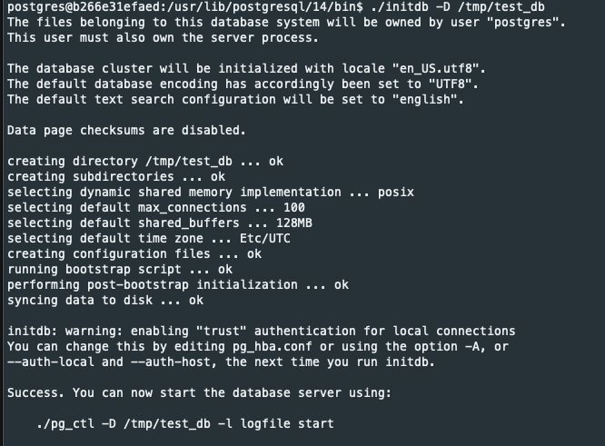

Zmieniono port serwera na `5440`

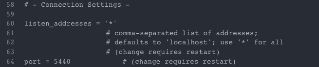

Uruchomiono serwer

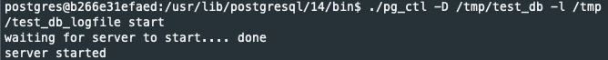

Połączono się do serwera do bazy `postgres` i utworzono tabelę `tbl`

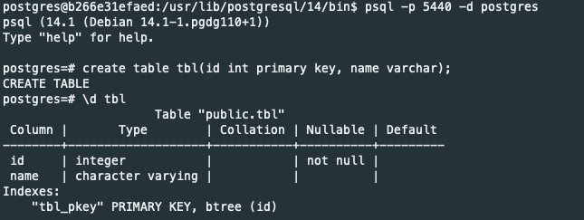

Do tabeli dodano 4 testowe rekordy

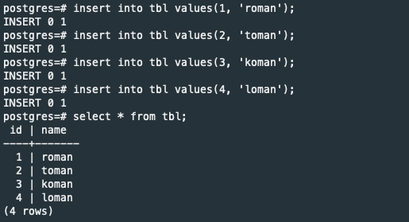

Usunięto rekordy o id mniejszym od 3, a następnie wszystkie rekordy

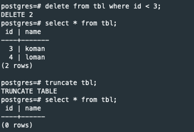

Usunięto tabelę `tbl`

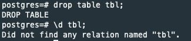

Zatrzymano instancję serwera

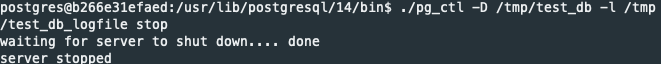

### Przebieg ćwiczenia

Utworzono i uruchomiono serwer `primary_db` na porcie `5433`, który nasłuchuje na połączenia z dowolnego adresu

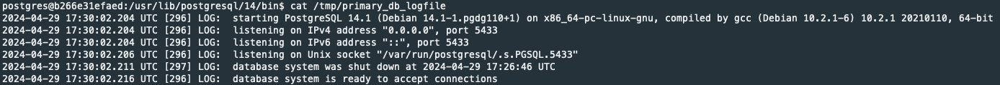

Stworzono użytkownika `repuser` z flagą `replication`

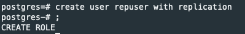

Umożliwiono użytkownikowi `repuser` łączenie się z serwerem z maszyny localhost w pliku `pg_hba.conf`

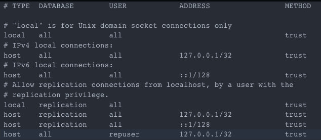

Utworzono replikę serwera o nazwie `replica_db`

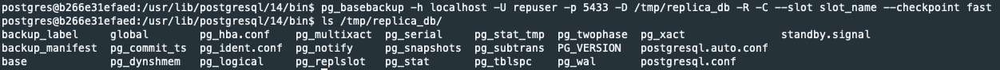

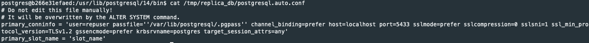

Uruchomiono replikę na porcie `5434`

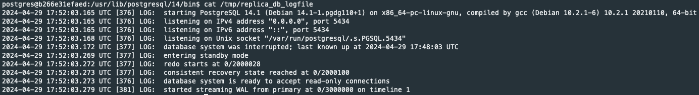

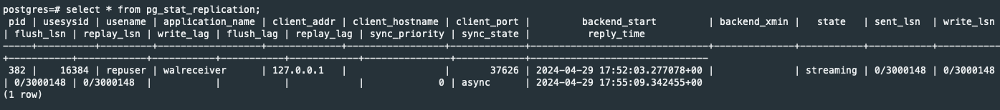

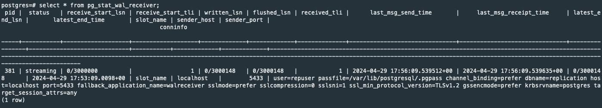

Na serwerze primary utworzono tabelę `tbl` i dodano do niej przykładowe rekordy

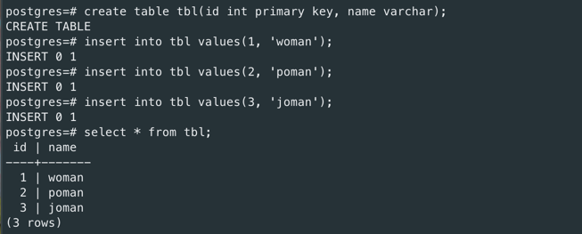

Na serwerze backup pojawiła się jej replika

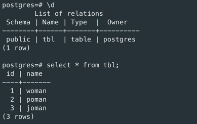

Przetestowano działanie operacji `DELETE` na tabeli na serwerze primary i sprawdzono ponownie tabelę na replice

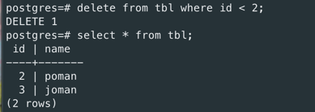

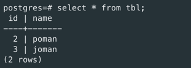

To samo przetestowano dla operacji `TRUNCATE`

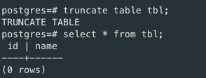

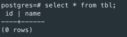

Zatrzymano instancję primary

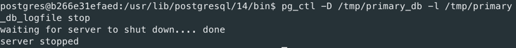

Wykonano ręcznego failovera i wypromowano serwer repliki na nowego mastera, a następnie przetestowano jej działanie

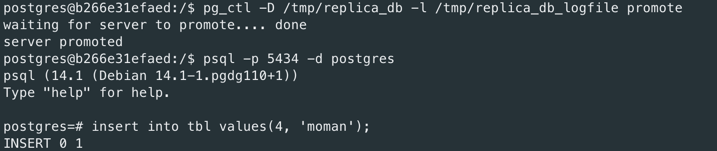

### Zadanie domowe

Dla `primary_db` stworzono multi standby setup z 3 innymi serwerami

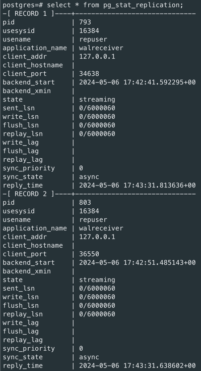

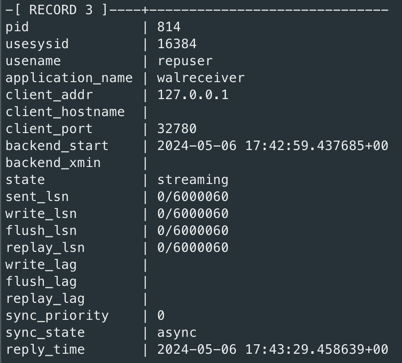

Oraz kaskadową replikację dla z 3 serwerami

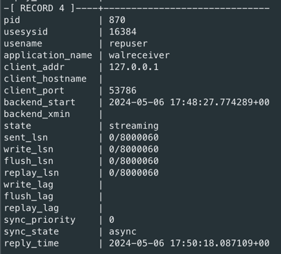

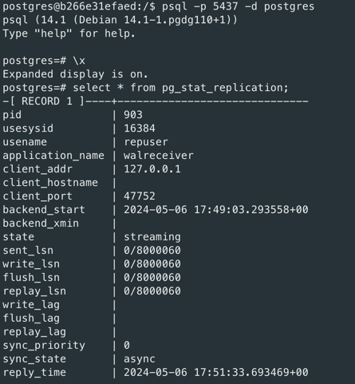

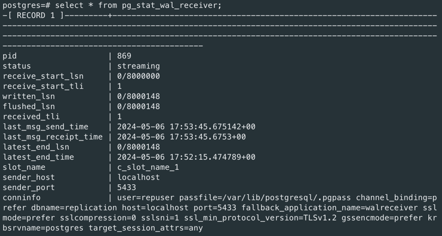

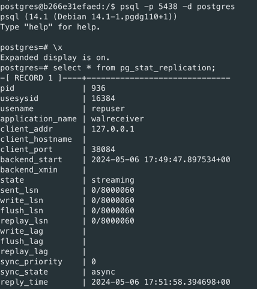

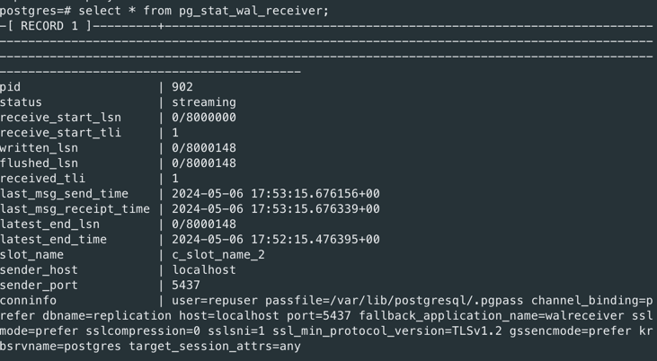

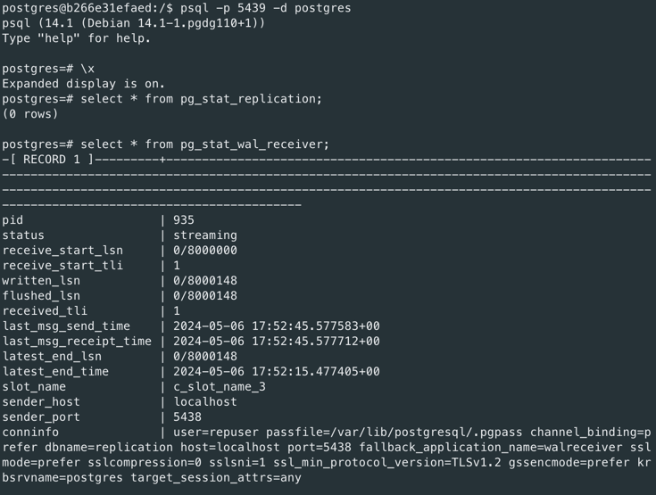