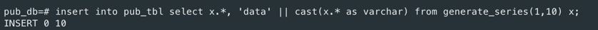
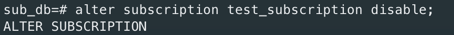

# Lab 10 - sprawozdanie
## Wojciech Przybytek, Dariusz Piwowarski

### Przebieg ćwiczenia

Utworzono serwery `publisher_db` i `subscriber_db`

Ustawiono port `publisher_db` na 5433 oraz `wal_level` na `logical`

Ustawiono port `subscriber_db` na 5434

Uruchomiono obie instancje

Połączono się z serwerem `publisher_db`, utworzono w nim baze `pub_db`, a w niej tabelę `pub_tbl`

Wygenerowano 10 wierszy w tabeli

Utworzono na serwerze `subscriber_db` bazę `sub_db`

Przekopiowano schemat tabeli `pub_tbl` do bazy `sub_db`

W bazie `pub_db` utworzono publikację `test_publication` na tabeli `pub_tbl`

W bazie `sub_db` utworzono subskrypcję `test_subscription` na wcześniej stworzoną publikację

W bazie `sub_db` dane w tabeli `pub_tbl` zostały przekopiowane

W logach publishera widać utworzenie publikacji

W logach subscribera widać utworzenie subskrypcji

Utworzenie nowych 10 rekordów w bazie `pub_db` w tabeli `pub_tbl`

Rekordy zostały przekopiowane do bazy `sub_db`

Nie udało się wykonać komendy update, otrzymaliśmy następujący komunikat o błędzie

Według informacji które znaleźliśmy, jest to spowodowane brakiem primary key w tabeli, ale można to też obejść wykonując
proponowane przez postgresa polecenie

Dane zostały poprawnie uaktualnione w replice

Wykonano komende delete na serwerze publishera

Rekordy zostały usunięte również z subscribera

Wykonano komende truncate na serwerze publishera

Rekordy zostały usunięte również z subscribera

Dodano do tabeli publishera nową kolumnę

Kolumna nie została zreplikowana na serwerze subscribera

Do zmodyfikowanej tabeli publishera dodano nowe rekordy

Rekordy nie zostały zreplikowane do tabeli subscribera

Aby naprawić replikację do tabeli subscribera dodano nową kolumnę a następnie odświeżono subskrypcję

Do tabeli subscribera dodano nową kolumnę

Do tabeli publishera dodano nowe rekordy

Rekordy zostały zreplikowane w tabeli subscribera, ich wartość w nowej kolumnie wynosiła `null`

Dane replikacji z serwera publishera (tabela `pg_stat_replication`)

Na serwerze subscribera tabela `pg_stat_replication` jest pusta, dane replikacji są zapisane w tabeli 
`pg_stat_subscription`

Zatrzymano subskrypcję na serwerze subscribera

Na serwerze publishera tabela `pg_stat_replication` jest pusta

Ponownie uruchomiono subskrypcję

### Rozszerzenie konfiguracji

Utworzono 2 nowe serwery -  `sub2_db` na porcie `5435` i `sub3_db` na porcie `5436`

Utworzono na nich odpowiednio bazy `sub2_db` i `sub3_db`

Przekopiowano schemat tabeli `pub_tbl` do nowo utworzonych baz

Stworzono subskrypcję na obu bazach do bazy publishera

Wszystkie 3 subskrypcje są widoczne w tabeli `pg_stat_replication` publishera

Dodano nowy rekord do tabeli w bazie publishera

Wszystkie bazy posiadają takie same rekody w tabeli

Następnie zmieniono sposób replikacji na kaskadowy (publisher -> sub1 -> sub2 -> sub3)

