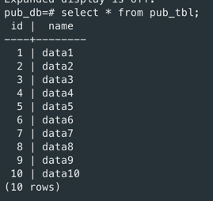

# Lab 10 - sprawozdanie
## Wojciech Przybytek, Dariusz Piwowarski

### Przebieg ćwiczenia

Utworzono serwery `publisher_db` i `subscriber_db`

Ustawiono port `publisher_db` na 5433 oraz `wal_level` na `logical`

Ustawiono port `subscriber_db` na 5434

Uruchomiono obie instancje

Połączono się z serwerem `publisher_db`, utworzono w nim baze `pub_db`, a w niej tabelę `pub_tbl`

Wygenerowano 10 wierszy w tabeli

Utworzono na serwerze `subscriber_db` bazę `sub_db`

Przekopiowano schemat tabeli `pub_tbl` do bazy `sub_db`

W bazie `pub_db` utworzono publikację `test_publication` na tabeli `pub_tbl`

W bazie `sub_db` utworzono subskrypcję `test_subscription` na wcześniej stworzoną publikację

W bazie `sub_db` dane w tabeli `pub_tbl` zostały przekopiowane

W logach publishera widać utworzenie publikacji

W logach subscribera widać utworzenie subskrypcji

Utworzenie nowych 10 rekordów w bazie `pub_db` w tabeli `pub_tbl`

Rekordy zostały przekopiowane do bazy `sub_db`

Nie udało się wykonać komendy update, otrzymaliśmy następujący komunikat o błędzie

Według informacji które znaleźliśmy, jest to spowodowane brakiem primary key w tabeli, ale można to też obejść wykonując
proponowane przez postgresa polecenie

Dane zostały poprawnie uaktualnione w replice
