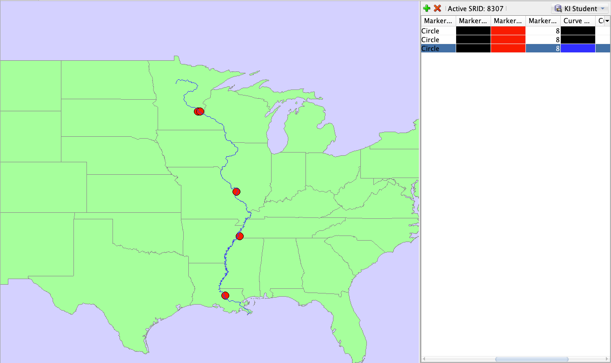
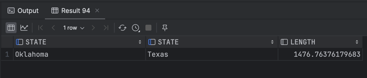

# Raport

# Przetwarzanie i analiza danych przestrzennych 
# Oracle spatial


---

**Imiona i nazwiska:**

--- 

Celem ćwiczenia jest zapoznanie się ze sposobem przechowywania, przetwarzania i analizy danych przestrzennych w bazach danych
(na przykładzie systemu Oracle spatial)

Swoje odpowiedzi wpisuj w miejsca oznaczone jako:

---
> Wyniki, zrzut ekranu, komentarz

```sql
--  ...
```

---

Do wykonania ćwiczenia (zadania 1 – 7) i wizualizacji danych wykorzystaj Oracle SQL Develper. Alternatywnie możesz wykonać analizy w środowisku Python/Jupyter Notebook

Do wykonania zadania 8 wykorzystaj środowisko Python/Jupyter Notebook

Raport należy przesłać w formacie pdf.

Należy też dołączyć raport zawierający kod w formacie źródłowym.

Np.
- plik tekstowy .sql z kodem poleceń
- plik .md zawierający kod wersji tekstowej
- notebook programu jupyter – plik .ipynb

Zamieść kod rozwiązania oraz zrzuty ekranu pokazujące wyniki, (dołącz kod rozwiązania w formie tekstowej/źródłowej)

Zwróć uwagę na formatowanie kodu

<div style="page-break-after: always;"></div>

# Zadanie 1

Zwizualizuj przykładowe dane

US_STATES


> Wyniki, zrzut ekranu, komentarz

```sql
select * from us_states;
```


US_INTERSTATES

> Wyniki, zrzut ekranu, komentarz

```sql
select * from us_interstates;
```


US_CITIES


> Wyniki, zrzut ekranu, komentarz

```sql
select * from us_cities;
```


US_RIVERS


> Wyniki, zrzut ekranu, komentarz

```sql
select * from us_rivers;
```


US_COUNTIES


> Wyniki, zrzut ekranu, komentarz

```sql
select * from us_counties;
```


US_PARKS


> Wyniki, zrzut ekranu, komentarz

```sql
select * from us_parks;
```


# Zadanie 2

Znajdź wszystkie stany (us_states) których obszary mają część wspólną ze wskazaną geometrią (prostokątem)

Pokaż wynik na mapie.

prostokąt

```sql
SELECT sdo_geometry(2003, 8307, null,
                    sdo_elem_info_array(1, 1003, 3),
                    sdo_ordinate_array(-117.0, 40.0, -90., 44.0)) g
FROM dual
```

> Wyniki, zrzut ekranu, komentarz

Wyświetlenie geometrii na mapie:


Użyj funkcji SDO_FILTER

```sql
SELECT state, geom
FROM us_states
WHERE sdo_filter(geom,
                 sdo_geometry(2003, 8307, null,
                              sdo_elem_info_array(1, 1003, 3),
                              sdo_ordinate_array(-117.0, 40.0, -90., 44.0))
      ) = 'TRUE';
```

Zwróć uwagę na liczbę zwróconych wierszy (16)


> Wyniki, zrzut ekranu, komentarz

Wykonanie zapytania z sdo_filter, zostało zwrócone 16 wierszy:


Pokazanie wyników zapytania z sdo_filter na mapie:


Użyj funkcji SDO_ANYINTERACT

```sql
SELECT state, geom
FROM us_states
WHERE sdo_anyinteract(geom,
                      sdo_geometry(2003, 8307, null,
                                   sdo_elem_info_array(1, 1003, 3),
                                   sdo_ordinate_array(-117.0, 40.0, -90., 44.0))
      ) = 'TRUE';
```

Porównaj wyniki sdo_filter i sdo_anyinteract

Pokaż wynik na mapie


> Wyniki, zrzut ekranu, komentarz

Wykonanie zapytania z sdo_anyinteract, zostało zwrócone 14 wierszy:


Pokazanie wyników zapytania z sdo_anyinteract na mapie:


Porównanie wyników obu zapytań, sdo_filter na czerwono i sdo_anyinteract na żółto:


Analiza wyników:

- Zapytanie z sdo_filter zwróciło 16 wierszy, czyli o 2 więcej niż zapytanie z sdo_anyinteract
- 14 stanów pokrywa się w wyniku obu zapytań
- Patrząc na wyświetloną w Oracle SQL Developer mapę, 2 dodatkowe stany zwrócone przez sdo_filter wydają sie nie mieć
  punktów wspólnych z geometrią (prostokątem)
- Różnica ta wynika z tego, że funkcja sdo_filter korzysta z Minimum Bounding Rectangle (MBR), czyli wyznacza
  najmniejszy prostokąt w który da się wpisać daną figurę nie będącą prostokątem i dopiero na tych figurach wyszykuje
  czy się przecinają. Zaletą tego podejścia jest to że obliczenia są prostsze i zdecydowanie mniej kosztowne (
  szczególnie dla skomplikowanych kształtów) dlatego stosuje się ją do wstępnego filtrowania danych. Wadą jest
  zwracanie "False Positive'ów" tak jak w naszym przypadku 2 dodatkowe stany.

# Zadanie 3

Znajdź wszystkie parki (us_parks) których obszary znajdują się wewnątrz stanu Wyoming

Użyj funkcji SDO_INSIDE

```sql
SELECT p.name, p.geom
FROM us_parks p, us_states s
WHERE s.state = 'Wyoming'
AND SDO_INSIDE (p.geom, s.geom ) = 'TRUE';
```

W przypadku wykorzystywania narzędzia SQL Developer, w celu wizualizacji na mapie użyj podzapytania

```sql
SELECT pp.name, pp.geom FROM us_parks pp
WHERE id IN
(
 SELECT p.id
 FROM us_parks p, us_states s
 WHERE s.state = 'Wyoming'
 and SDO_INSIDE (p.geom, s.geom ) = 'TRUE'
)
```


> Wyniki, zrzut ekranu, komentarz

Wizualizacja parków na mapie. Bez widocznego stanu Wyoming ciężko potwierdzić poprawność zapytania.


```sql
SELECT state, geom FROM us_states
WHERE state = 'Wyoming'
```


> Wyniki, zrzut ekranu, komentarz

Mapa z naniesionym stanem Wyoming, widać, że parki są wewnątrz tego stanu.


Porównaj wynik z:

```sql
SELECT p.name, p.geom
FROM us_parks p, us_states s
WHERE s.state = 'Wyoming'
AND SDO_ANYINTERACT (p.geom, s.geom ) = 'TRUE';
```

W celu wizualizacji użyj podzapytania


> Wyniki, zrzut ekranu, komentarz

```sql
SELECT pp.name, pp.geom FROM us_parks pp
WHERE id IN
(
 SELECT p.id
 FROM us_parks p, us_states s
 WHERE s.state = 'Wyoming'
 and SDO_ANYINTERACT (p.geom, s.geom ) = 'TRUE'
)
```

Funkcja SDO_ANYINTERACT zwraca parki, które mają część wspólną ze stanem Wyoming, ale niekoniecznie są wewnątrz tego stanu.


# Zadanie 4

Znajdź wszystkie jednostki administracyjne (us_counties) wewnątrz stanu New Hampshire

```sql
SELECT c.county, c.state_abrv, c.geom
FROM us_counties c, us_states s
WHERE s.state = 'New Hampshire'
AND SDO_RELATE ( c.geom,s.geom, 'mask=INSIDE+COVEREDBY') = 'TRUE';

SELECT c.county, c.state_abrv, c.geom
FROM us_counties c, us_states s
WHERE s.state = 'New Hampshire'
AND SDO_RELATE ( c.geom,s.geom, 'mask=INSIDE') = 'TRUE';

SELECT c.county, c.state_abrv, c.geom
FROM us_counties c, us_states s
WHERE s.state = 'New Hampshire'
AND SDO_RELATE ( c.geom,s.geom, 'mask=COVEREDBY') = 'TRUE';
```

W przypadku wykorzystywania narzędzia SQL Developer, w celu wizualizacji danych na mapie należy użyć podzapytania (podobnie jak w poprzednim zadaniu)


> Wyniki, zrzut ekranu, komentarz

```sql
SELECT cc.county, cc.state_abrv, cc.geom FROM us_counties cc
WHERE id IN
(
SELECT c.id
FROM us_counties c, us_states s
WHERE s.state = 'New Hampshire'
AND SDO_RELATE ( c.geom,s.geom, 'mask=INSIDE+COVEREDBY') = 'TRUE'
)

SELECT state, geom FROM us_states
WHERE state = 'New Hampshire'
```

Wynikiem powyższego zapytania są jednostki administracyjne, które znajdują wewnątrz stanu New Hampshire.


```sql
SELECT cc.county, cc.state_abrv, cc.geom FROM us_counties cc
WHERE id IN
(
SELECT c.id
FROM us_counties c, us_states s
WHERE s.state = 'New Hampshire'
AND SDO_RELATE ( c.geom,s.geom, 'mask=INSIDE') = 'TRUE'
)

SELECT state, geom FROM us_states
WHERE state = 'New Hampshire'
```

Wykonanie tego zapytania zwraca jednostki administracyjne, które są wewnątrz stanu New Hampshire, i nie mają części 
wspólnej z granicą stanu.


```sql
SELECT cc.county, cc.state_abrv, cc.geom FROM us_counties cc
WHERE id IN
(
SELECT c.id
FROM us_counties c, us_states s
WHERE s.state = 'New Hampshire'
AND SDO_RELATE ( c.geom,s.geom, 'mask=COVEREDBY') = 'TRUE'
)

SELECT state, geom FROM us_states
WHERE state = 'New Hampshire'
```

Wynikiem tego zapytania są jednostki administracyjne, które są wewnątrz stanu New Hampshire, ale chociaż część ich 
granicy pokrywa się z granicą stanu.


# Zadanie 5

Znajdź wszystkie miasta w odległości 50 mili od drogi (us_interstates) I4

Pokaż wyniki na mapie

```sql
SELECT * FROM us_interstates
WHERE interstate = 'I4'

SELECT * FROM us_states
WHERE state_abrv = 'FL'

SELECT c.city, c.state_abrv, c.location
FROM us_cities c
WHERE ROWID IN
(
SELECT c.rowid
FROM us_interstates i, us_cities c
WHERE i.interstate = 'I4'
AND sdo_within_distance (c.location, i.geom,'distance=50 unit=mile') = 'TRUE'
);
```


> Wyniki, zrzut ekranu, komentarz


Dodatkowo:

a)     Znajdz wszystkie jednostki administracyjne przez które przechodzi droga I4

b)    Znajdz wszystkie jednostki administracyjne w pewnej odległości od I4

c)     Znajdz rzeki które przecina droga I4

d)    Znajdz wszystkie drogi które przecinają rzekę Mississippi

e)    Znajdz wszystkie miasta w odlegości od 15 do 30 mil od drogi 'I275'

f)      Itp. (własne przykłady)


> Wyniki, zrzut ekranu, komentarz
> (dla każdego z podpunktów)

a)

Zapytanie:
```sql
SELECT c.county, c.geom
FROM us_counties c
WHERE ROWID IN
(
SELECT c.rowid
FROM us_interstates i, us_counties c
WHERE i.interstate = 'I4'
AND SDO_ANYINTERACT (i.geom, c.geom ) = 'TRUE'
);
```
Wynik:


b)

Zapytanie:
```sql
SELECT c.county, c.geom
FROM us_counties c
WHERE ROWID IN
(
SELECT c.rowid
FROM us_interstates i, us_counties c
WHERE i.interstate = 'I4'
AND SDO_WITHIN_DISTANCE (i.geom, c.geom,'distance=10 unit=mile') = 'TRUE'
);
```

Wynik:


c)

Zapytanie:
```sql
SELECT r.name, r.geom
FROM us_rivers r
WHERE ROWID IN
(
SELECT r.rowid
FROM us_interstates i, us_rivers r
WHERE i.interstate = 'I4'
AND SDO_ANYINTERACT (i.geom, r.geom ) = 'TRUE'
);
```

Wynik:


d)

Zapytanie:
```sql
SELECT i.interstate, i.geom
FROM us_interstates i
WHERE ROWID IN
(
SELECT i.rowid
FROM us_interstates i, us_rivers r
WHERE r.name = 'Mississippi'
AND SDO_ANYINTERACT (i.geom, r.geom ) = 'TRUE'
);
```

Wynik:


e)

Zapytanie:

```sql
SELECT c.city, c.state_abrv, c.location
FROM us_cities c
WHERE ROWID IN
(
SELECT c.rowid
FROM us_interstates i, us_cities c
WHERE i.interstate = 'I275'
AND SDO_WITHIN_DISTANCE(c.location, i.geom, 'distance=30 unit=mile') = 'TRUE'
AND SDO_GEOM.SDO_DISTANCE(c.location, i.geom, 0.5, 'unit=mile') >= 15
);
```

Wynik:


f)

Przykład 1 - znaleźć wszystkie miasta, których odległość od rzeki Mississipi jest większa niż 500 mil

Zapytanie:
```sql
SELECT c.city, c.state_abrv, c.location
FROM us_cities c
WHERE ROWID IN
(
SELECT c.rowid
FROM us_cities c, us_rivers r
WHERE r.name = 'Mississippi'
AND SDO_GEOM.SDO_DISTANCE(c.location, r.geom, 0.5, 'unit=mile') > 500
);
```

Wynik:


Przykład 2 - znaleźć rzeki, które przechodzą przez więcej niż 5 stanów

Zapytanie:
```sql
SELECT r.name, r.geom
FROM us_rivers r
WHERE ROWID IN
(
SELECT r.rowid
FROM us_rivers r, us_states s
WHERE SDO_ANYINTERACT (r.geom, s.geom ) = 'TRUE'
GROUP BY r.rowid
HAVING count(*) > 5
);
```

Wynik:


# Zadanie 6

Znajdz 5 miast najbliższych drogi I4

```sql
SELECT c.city, c.state_abrv, c.location
FROM us_interstates i, us_cities c 
WHERE i.interstate = 'I4'
AND sdo_nn(c.location, i.geom, 'sdo_num_res=5') = 'TRUE';
```

>Wyniki, zrzut ekranu, komentarz

```sql
select cc.city, cc.STATE_ABRV, cc.LOCATION
from US_CITIES cc
where cc.id in
      (select c.id
       from US_INTERSTATES i,
            US_CITIES c
       where i.INTERSTATE = 'I4'
         and sdo_nn(c.location, i.geom, 'sdo_num_res=5') = 'TRUE');

select i.GEOM from US_INTERSTATES i where i.INTERSTATE = 'I4';
```


Dodatkowo:

a)     Znajdz kilka miast najbliższych rzece Mississippi

b)    Znajdz 3 miasta najbliżej Nowego Jorku

c)     Znajdz kilka jednostek administracyjnych (us_counties) z których jest najbliżej do Nowego Jorku

d)    Znajdz 5 najbliższych miast od drogi  'I170', podaj odległość do tych miast

e)    Znajdz 5 najbliższych dużych miast (o populacji powyżej 300 tys) od drogi  'I170'

f)      Itp. (własne przykłady)


> Wyniki, zrzut ekranu, komentarz
> (dla każdego z podpunktów)

a) Pięć najbliższych miast rzeki Mississippi:

```sql
select cc.city, cc.STATE_ABRV, cc.LOCATION
from US_CITIES cc
where cc.id in
      (select c.id
       from US_RIVERS i,
            US_CITIES c
       where i.NAME = 'Mississippi'
         and sdo_nn(c.location, i.geom, 'sdo_num_res=5') = 'TRUE');

select i.GEOM from US_RIVERS i where i.NAME = 'Mississippi';
```




b) 3 miasta najbliżej Nowego Jorku (w zapytaniu wybieramy 4 miasta, ponieważ miastem najbliżej Nowego Jorku jest 
Nowy Jork, którego nie uwzględniamy)

```sql
select cc.city, cc.STATE_ABRV, cc.LOCATION
from US_CITIES cc
where cc.id in
      (select c1.id
       from US_CITIES c1,
            US_CITIES c2
       where c2.CITY = 'New York'
         and c1.CITY != 'New York'
         and sdo_nn(c1.location, c2.LOCATION, 'sdo_num_res=4') = 'TRUE');

select i.LOCATION
from US_CITIES i
where i.CITY = 'New York';
```


c) 5 jednostek administacyjnych z których najbliżej do Nowego Jorku

```sql
select cc.COUNTY, cc.GEOM
from US_COUNTIES cc
where cc.id in
      (select c1.id
       from US_COUNTIES c1,
            US_CITIES c2
       where c2.CITY = 'New York'
         and sdo_nn(c1.GEOM, c2.LOCATION, 'sdo_num_res=5') = 'TRUE');

select i.LOCATION
from US_CITIES i
where i.CITY = 'New York';
```


d) 5 najbliższych miast od drogi 'I170'

```sql
-- query to select cities on map
select cc.city, cc.STATE_ABRV, cc.LOCATION
from US_CITIES cc
where cc.id in
      (select c.id
       from US_INTERSTATES i,
            US_CITIES c
       where i.INTERSTATE = 'I170'
         and sdo_nn(c.location, i.geom, 'sdo_num_res=5') = 'TRUE');

-- query to show distance from city to road
select cc.city, cc.STATE_ABRV, cc.LOCATION, SDO_GEOM.sdo_distance(cc.LOCATION, ii.GEOM, 0.01, 'unit=KM') as dist
from US_CITIES cc,
     US_INTERSTATES ii
where ii.INTERSTATE = 'I170'
  and cc.id in
      (select c.id
       from US_INTERSTATES i,
            US_CITIES c
       where i.INTERSTATE = 'I170'
         and sdo_nn(c.location, i.geom, 'sdo_num_res=5') = 'TRUE');

select i.GEOM
from US_INTERSTATES i
where i.INTERSTATE = 'I170';
```


e) 5 największych dużych miast od I170

```sql
select cc.city, cc.STATE_ABRV, cc.LOCATION
from US_CITIES cc
where cc.id in
      (select c.id
       from US_INTERSTATES i,
            (select * from US_CITIES where POP90 > 300000) c
       where i.INTERSTATE = 'I170'
         and sdo_nn(c.location, i.geom, 1) = 'TRUE'
         and ROWNUM <= 5);

select i.GEOM
from US_INTERSTATES i
where i.INTERSTATE = 'I170';
```


f) 5 dróg najbliżej Nowego Jorku

```sql
select cc.INTERSTATE, cc.GEOM
from US_INTERSTATES cc
where cc.id in
      (select c1.id
       from US_INTERSTATES c1,
            US_CITIES c2
       where c2.CITY = 'New York'
         and sdo_nn(c1.GEOM, c2.LOCATION, 'sdo_num_res=5') = 'TRUE');

select i.LOCATION
from US_CITIES i
where i.CITY = 'New York';
```


g) 5 dlugich dróg (> 100km) najbliżej Nowego Jorku

```sql
select ii.id, ii.INTERSTATE, ii.GEOM
from US_INTERSTATES ii
where ii.id in (select i.id
                from US_INTERSTATES i,
                     US_CITIES c
                where c.CITY = 'New York'
                  and sdo_nn(i.GEOM, c.LOCATION, 1) = 'TRUE'
                  and SDO_GEOM.SDO_LENGTH(i.geom, 0.5, 'unit=kilometer') > 100
                  and rownum <= 5);

select i.LOCATION
from US_CITIES i
where i.CITY = 'New York';
```


# Zadanie 7

Oblicz długość drogi I4

```sql
SELECT SDO_GEOM.SDO_LENGTH (geom, 0.5,'unit=kilometer') length
FROM us_interstates
WHERE interstate = 'I4';
```

>Wyniki, zrzut ekranu, komentarz

Wynik:


Dodatkowo:

a)     Oblicz długość rzeki Mississippi

Zapytanie:
```sql
SELECT SDO_GEOM.SDO_LENGTH (geom, 0.5,'unit=kilometer') length
FROM us_rivers
WHERE name = 'Mississippi';
```

Wynik:


b)    Która droga jest najdłuższa/najkrótsza

Zapytanie:
```sql
-- Najdłuższa
SELECT interstate, SDO_GEOM.SDO_LENGTH (geom, 0.5,'unit=kilometer') length
FROM us_interstates
ORDER BY length desc
FETCH NEXT 1 ROW ONLY;

-- Najkrótsza
SELECT interstate, SDO_GEOM.SDO_LENGTH (geom, 0.5,'unit=kilometer') length
FROM us_interstates
ORDER BY length
FETCH NEXT 1 ROW ONLY;
```

Wyniki:


c)     Która rzeka jest najdłuższa/najkrótsza

Zapytanie:
```sql
-- Najdłuższa
SELECT name, SDO_GEOM.SDO_LENGTH (geom, 0.5,'unit=kilometer') length
FROM us_rivers
ORDER BY length desc
FETCH NEXT 1 ROW ONLY;

-- Najkrótsza
SELECT name, SDO_GEOM.SDO_LENGTH (geom, 0.5,'unit=kilometer') length
FROM us_rivers
ORDER BY length
FETCH NEXT 1 ROW ONLY;
```

Wyniki:


Komentarz:
o ile w przypadku dróg wynik był stosunkowo poprawny, to rzeki w wykorzystywanej bazie nie zawsze są reprezentowane jako zwykła
krzywa, ale czasem mają bardziej złożony kształt przez co otrzymany wynik (długość krzywej) nie do końca pokrywa się z długością rzeki
która podawana jest w innych źródłach. Przykład takiego fragmentu rzeki został przedstawiony poniżej:


d)    Które stany mają najdłuższą granicę

Zapytanie:
```sql
SELECT s.state, ss.state, SDO_GEOM.SDO_LENGTH(SDO_GEOM.SDO_INTERSECTION(s.geom, ss.geom, 0.5), 0.5,'unit=kilometer') as length
FROM US_STATES s, US_STATES ss
WHERE s.id != ss.id AND SDO_GEOM.SDO_LENGTH(SDO_GEOM.SDO_INTERSECTION(s.geom, ss.geom, 0.5), 0.5,'unit=kilometer') IS NOT NULL
ORDER BY length desc
FETCH NEXT 1 ROW ONLY;
```

Wynik:



e)    Itp. (własne przykłady)


> Wyniki, zrzut ekranu, komentarz
> (dla każdego z podpunktów)

```sql
--  ...
```

Oblicz odległość między miastami Buffalo i Syracuse

```sql
SELECT SDO_GEOM.SDO_DISTANCE ( c1.location, c2.location, 0.5) distance
FROM us_cities c1, us_cities c2
WHERE c1.city = 'Buffalo' and c2.city = 'Syracuse';
```


>Wyniki, zrzut ekranu, komentarz

```sql
--  ...
```

Dodatkowo:

a)     Oblicz odległość między miastem Tampa a drogą I4

b)    Jaka jest odległość z między stanem Nowy Jork a  Florydą

c)     Jaka jest odległość z między miastem Nowy Jork a  Florydą

d)    Podaj 3 parki narodowe do których jest najbliżej z Nowego Jorku, oblicz odległości do tych parków

e)    Przetestuj działanie funkcji

a.     sdo_intersection, sdo_union, sdo_difference

b.     sdo_buffer

c.     sdo_centroid, sdo_mbr, sdo_convexhull, sdo_simplify

f)      Itp. (własne przykłady)


> Wyniki, zrzut ekranu, komentarz
> (dla każdego z podpunktów)

```sql
--  ...
```


Zadanie 8

Wykonaj kilka własnych przykładów/analiz


>Wyniki, zrzut ekranu, komentarz

```sql
--  ...
```

Punktacja

|   |   |
|---|---|
|zad|pkt|
|1|0,5|
|2|1|
|3|1|
|4|1|
|5|3|
|6|3|
|7|6|
|8|4|
|razem|20|
